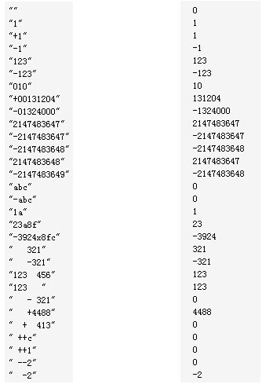
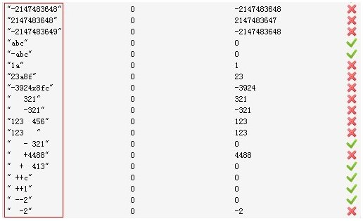
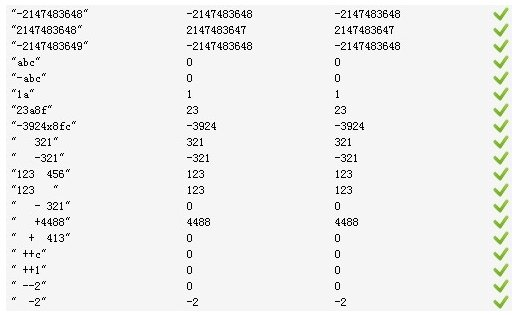
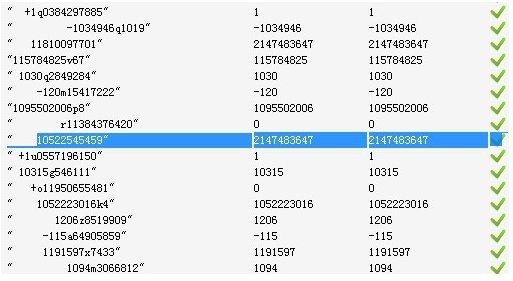
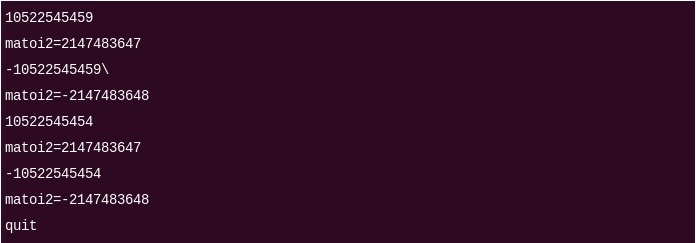

# 字符串转换成整数

## 题目描述
输入一个由数字组成的字符串，把该字符串转换成整数并输出。例如：输入字符串"345"，输出整数345。
给定函数原型`int StrToInt(const char *str)` ，完成函数StrToInt，实现字符串转换成整数的功能，不得用库函数atoi（即便准许使用，其对于溢出情况的处理也达不到题目的要求，详情请参看下文）。

## 分析与解法
我们来一步一步分析（共9小节，重点在下文第8小节及后续内容），直至写出第一份准确的代码：

以"345"作为例子：
1. 当扫描到字符串的第一个字符'3'时，由于我们知道这是第一位，所以得到数字3。  
2. 当扫描到第二个字符'4'时，由于前面有一个3，所以前面的3相当于30。得到数字：3\*10+4=34。  
3. 当扫最后的描到字符'5'时，由于前面的34相当于340，所以最终得到的数是：34\*10+5=345。  
因此，此题的思路便是：每扫描到一个字符，我们便把在之前得到的数字乘以10，然后再加上当前字符表示的数字。  

有一些细节需要注意，
1. 正负符号：整数不仅包含数字，还有可能以'+'或者'-'开头以表示正负整数，因此如果第一个字符是'-'号，则要把得到的整数转换成负整数。
2. 空指针输入：输入的是指针，在访问空指针时程序会崩溃，因此在使用指针之前需要先判断指针是否为空。 
3. 非法字符：输入的字符串中可能含有不是数字的字符。因此，每当碰到这些非法的字符，程序应停止转换。  
4. 整型溢出：输入的数字是以字符串的形式输入，因此输入一个很长的字符串将可能导致溢出。

如图，输入字符串和分析的结果。（假定运行环境是32位系统，且编译环境是VS2008以上）：  



### 代码一

初步实现：

```cpp
//copyright@zhedahht 2007
enum Status {kValid = 0, kInvalid};
int g_nStatus = kValid;

// Convert a string into an integer
int StrToInt(const char* str)
{
    g_nStatus = kInvalid;
    long long num = 0;

    if (str != NULL)
    {
        const char* digit = str;

        // the first char in the string can be '+' or '-'
        bool minus = false;
        if (*digit == '+')
            digit ++;
        else if (*digit == '-')
        {
            digit ++;
            minus = true;
        }

        // the remaining chars in the string
        while (*digit != '\0')
        {
            if (*digit >= '0' && *digit <= '9')
            {
                num = num * 10 + (*digit - '0');

                // overflow
                if (num > std::numeric_limits<int>::max())
                {
                    num = 0;
                    break;
                }

                digit ++;
            }
            // if the char is not a digit, invalid input
            else
            {
                num = 0;
                break;
            }
        }

        if (*digit == '\0')
        {
            g_nStatus = kValid;
            if (minus)
                num = 0 - num;
        }
    }
    return static_cast<int>(num);
}
```
尝试运行上述程序，会发现：输入某些字符串时，程序出错（下图红叉叉对应条目）:  



开始修复：

1.非法字符问题。如“1a”，正确的结果应该得到1：  

```cpp
// if the char is not a digit, invalid input  
                  else  
                  {  
                      num = 0;  
                      break;  
                  } 
```

2.整型溢出问题。如“24147483648”将产生溢出，正确的结果应该得到0： 

```cpp
// overflow    
                if (num > std::numeric_limits<int>::max())  
                {  
                    num = 0;  
                    break;  
                }  
```

### 代码二

把代码做下微调，如下（注：库函数atoi规定超过int值，按最大值maxint：2147483647来，超过-int按最小值minint：-2147483648来）：  

```c
//copyright@SP_daiyq 2013/5/29
int StrToInt(const char* str)
{
    int res = 0; // result
    int i = 0; // index of str
    int signal = '+'; // signal '+' or '-'
    int cur; // current digit

    if (!str)
        return 0;

    // skip backspace
    while (isspace(str[i]))
        i++;

    // skip signal
    if (str[i] == '+' || str[i] == '-')
    {
        signal = str[i];
        i++;
    }

    // get result
    while (str[i] >= '0' && str[i] <= '9')
    {
        cur = str[i] - '0';

        // judge overlap or not
        if ( (signal == '+') && (cur > INT_MAX - res * 10) )
        {
            res = INT_MAX;
            break;
        }
        else if ( (signal == '-') && (cur - 1 > INT_MAX - res * 10) )
        {
            res = INT_MIN;
            break;
        }

        res = res * 10 + cur;
        i++;
    }

    return (signal == '-') ? -res : res;
}
```
 此时会发现，上面第3小节末所述的第1个小问题（当输入的字符串不是数字，而是字符的时候）解决了：  



但， 上文第3小节末所述的第2个小问题：溢出问题却没有解决。即当给定下述测试数据的时候，问题就来了：  


什么问题呢？比如说用上述代码转换这个字符串："    10522545459"，它本应得到的正确结果应该是2147483647，但程序实际得到的结果却是：1932610867。故很明显，程序没有解决好上面的第2个小问题：溢出问题。原因是什么呢？咱们来分析下代码，看是如何具体处理溢出情况的：  

```c
// judge overlap or not  
        if ( (signal == '+') && (cur > INT_MAX - res * 10) )  
        {  
            res = INT_MAX;  
            break;  
        }  
        else if ( (signal == '-') && (cur - 1 > INT_MAX - res * 10) )  
        {  
            res = INT_MIN;  
            break;  
        }  
```
接着上面的例子来，比如给定字符串"    10522545459"，除去空格有11位，而MAX_INT，即2147483647是10位数，当扫描到最后一个字符‘9’的时候，程序会比较 9 和 2147483647 - 1052254545\*10的大小。  
问题立马就暴露出来了，因为此时让res\*10，即让1052254545\*10 > MAX_INT，溢出无疑，程序已经出错，再执行下面这行代码已无意义：  
```c
  cur > INT_MAX - res*10    
```

也就是说，对于字符串"10522545459", 当扫描到最后一个字符‘9’时，根据上文第1小节的字符串转换成整数的思路：“每扫描到一个字符，我们便把在之前得到的数字乘以10，然后再加上当前字符表示的数字”，为了得到最终的整数，我们得如此计算：    
1052254545\*10 + 4，  
实际上当程序计算到1052254545\*10时，  
1052254545\*10 > 2147483647  
此时已经溢出了,若再执意计算，则程序逻辑将出错，故此后也就不能再判断字串的最后一位4是否大于2147483647%10了（耐不得烦想尽快看到最终正确代码的读者可以直接跳到下文第8节）。    

### 代码三

上面说给的程序没有“很好的解决溢出问题。由于输入的数字是以字符串的形式输入，因此有可能输入一个很大的数字转换之后会超过能够表示的最大的整数而溢出”。那么，到底代码该如何写呢？  

像下面这样？：
```c
//copyright@fuwutu 2013/5/29
int StrToInt(const char* str)
{
    bool negative = false;
    long long result = 0;
    while (*str == ' ' || *str == '\t')
    {
        ++str;
    }
    if (*str == '-')
    {
        negative = true;
        ++str;
    }
    else if (*str == '+')
    {
        ++str;
    }

    while (*str != '\0')
    {
        int n = *str - '0';
        if (n < 0 || n > 9)
        {
            break;
        }

        if (negative)
        {
            result = result * 10 - n;
            if (result < -2147483648LL)
            {
                result = -2147483648LL;
            }
        }
        else
        {
            result = result * 10 + n;
            if (result > 2147483647LL)
            {
                result = 2147483647LL;
            }
        }
        ++str;
    }

    return result;
}
```

run下程序，看看运行结果：  



上图所示程序貌似通过了，然实际上它还是未能处理数据溢出的问题，因为它只是做了个取巧，即把返回的值result定义成了long long，如下所示：  
```c
  long long result = 0;  
```
故严格说来，我们依然未写出准确的规范代码  

### 代码四

咱们接下来便看看linux内核中是如何实现此字符串转换为整数的问题的。linux内核中提供了以下几个函数：  

1. simple_strtol，把一个字符串转换为一个有符号长整数；  
2. simple_strtoll，把一个字符串转换为一个有符号长长整数；  
3. simple_strtoul，把一个字符串转换为一个无符号长整数；  
4. simple_strtoull，把一个字符串转换为一个无符号长长整数  

相关源码及分析如下。  
首先，atoi调下面的strtol：  

```c
//linux/lib/vsprintf.c  
//Copyright (C) 1991, 1992  Linus Torvalds  
//simple_strtol - convert a string to a signed long  
long simple_strtol(const char *cp, char **endp, unsigned int base)  
{  
    if (*cp == '-')  
        return -simple_strtoul(cp + 1, endp, base);  
  
    return simple_strtoul(cp, endp, base);  
}  
EXPORT_SYMBOL(simple_strtol);  
```

然后，上面的strtol调下面的strtoul：  
```c
//simple_strtoul - convert a string to an unsigned long  
unsigned long simple_strtoul(const char *cp, char **endp, unsigned int base)  
{  
    return simple_strtoull(cp, endp, base);  
}  
```

接着，上面的strtoul调下面的strtoull：  

```c
//simple_strtoll - convert a string to a signed long long  
long long simple_strtoll(const char *cp, char **endp, unsigned int base)  
{  
    if (*cp == '-')  
        return -simple_strtoull(cp + 1, endp, base);  
  
    return simple_strtoull(cp, endp, base);  
}  
```

最后，strtoull调`_parse_integer_fixup_radix`和`_parse_integer`来处理相关逻辑：  
```c
//simple_strtoull - convert a string to an unsigned long long  
unsigned long long simple_strtoull(const char *cp, char **endp, unsigned int base)  
{  
    unsigned long long result;  
    unsigned int rv;  
  
    cp = _parse_integer_fixup_radix(cp, &base);  
    rv = _parse_integer(cp, base, &result);  
    /* FIXME */  
    cp += (rv & ~KSTRTOX_OVERFLOW);  
  
    if (endp)  
        *endp = (char *)cp;  
  
    return result;  
}  
```
重头戏来了。接下来，我们来看上面strtoull函数中的`parse_integer_fixup_radix`和`_parse_integer`两段代码。如鲨鱼所说  

* “真正的处理逻辑主要是在`_parse_integer`里面，关于溢出的处理，`_parse_integer`处理的很优美，  
* 而`_parse_integer_fixup_radix`是用来自动根据字符串判断进制的”。  

先来看`_parse_integer`函数：  

```c
//lib/kstrtox.c, line 39    
//Convert non-negative integer string representation in explicitly given radix to an integer.    
//Return number of characters consumed maybe or-ed with overflow bit.    
//If overflow occurs, result integer (incorrect) is still returned.    
unsigned int _parse_integer(const char *s, unsigned int base, unsigned long long *p)    
{    
    unsigned long long res;    
    unsigned int rv;    
    int overflow;    
    
    res = 0;    
    rv = 0;    
    overflow = 0;    
    while (*s) {    
        unsigned int val;    
    
        if ('0' <= *s && *s <= '9')    
            val = *s - '0';    
        else if ('a' <= _tolower(*s) && _tolower(*s) <= 'f')    
            val = _tolower(*s) - 'a' + 10;    
        else    
            break;    
    
        if (val >= base)    
            break;    
        /*  
         * Check for overflow only if we are within range of  
         * it in the max base we support (16)  
         */    
        if (unlikely(res & (~0ull << 60))) {    
            if (res > div_u64(ULLONG_MAX - val, base))    
                overflow = 1;    
        }    
        res = res * base + val;    
        rv++;    
        s++;    
    }    
    *p = res;    
    if (overflow)    
        rv |= KSTRTOX_OVERFLOW;    
    return rv;    
}  
```

解释下两个小细节：  

1.上头出现了个unlikely，其实unlikely和likely经常出现在linux相关内核源码中  

```c
if(likely(value)){  
    //等价于if(likely(value)) == if(value)  
}  
else{  
}  
```
likely表示value为真的可能性更大，而unlikely表示value为假的可能性更大，这两个宏被定义成：  

```c
//include/linux/compiler.h  
# ifndef likely  
#  define likely(x) (__builtin_constant_p(x) ? !!(x) : __branch_check__(x, 1))  
# endif  
# ifndef unlikely  
#  define unlikely(x)   (__builtin_constant_p(x) ? !!(x) : __branch_check__(x, 0))  
# endif  
```

2.呈现下div_u64的代码：  

```c
//include/linux/math64.h  
//div_u64  
static inline u64 div_u64(u64 dividend, u32 divisor)  
{  
    u32 remainder;  
    return div_u64_rem(dividend, divisor, &remainder);  
}  
  
//div_u64_rem  
static inline u64 div_u64_rem(u64 dividend, u32 divisor, u32 *remainder)  
{  
    *remainder = dividend % divisor;  
    return dividend / divisor;  
} 
```

最后看下`_parse_integer_fixup_radix`函数：  

```c
//lib/kstrtox.c, line 23  
const char *_parse_integer_fixup_radix(const char *s, unsigned int *base)  
{  
    if (*base == 0) {  
        if (s[0] == '0') {  
            if (_tolower(s[1]) == 'x' && isxdigit(s[2]))  
                *base = 16;  
            else  
                *base = 8;  
        } else  
            *base = 10;  
    }  
    if (*base == 16 && s[0] == '0' && _tolower(s[1]) == 'x')  
        s += 2;  
    return s;  
}  
```

读者MJN君在我的建议下，对上述linux内核中的atoi函数进行了测试，咱们来看下测试结果如何。  


如上，根据程序的输出结果可以看出，对于某些溢出的情况，atoi程序的处理并不符合本题的要求。  
也就是说，atoi程序对溢出的处理是一个标准，而本题要求对溢出的处理则是另外一个标准，所以说直接用atoi程序达不到本题的要求，但你不能因为本题的标准而否认atoi程序的正确性。  
既然直接借用atoi的源码（原理是parseXXX，`int i=Integer.parseInt(String str)`，把str转换成int的方法），不符合题目要求，则咱们另寻他路。  
路漫漫其修远兮，吾等将上下而求索，但与此同时，我们已渐入佳境。  

### 代码五

根据我们第1小节达成一致的字符串转换成整数的思路：“每扫描到一个字符，我们便把在之前得到的数字乘以10，然后再加上当前字符表示的数字”，相信读者已经觉察到，在扫描到最后一个字符的时候，如果之前得到的数比较大，此时若再让其扩大10倍，相对来说是比较容易溢出的。  

但车到山前必有路，既然让一个比较大的int整型数括大10倍，比较容易溢出， 那么在不好判断是否溢出的情况下，可以尝试使用除法。即如MJN所说：  

1. 与其将n扩大10倍,，冒着溢出的风险, 再与MAX_INT进行比较（如果已经溢出, 则比较的结果没有意义），  
2. 不如未雨绸缪先用n与MAX_INT/10进行比较： 若n>MAX_INT/10（当然同时还要考虑n=MAX_INT/10的情况）， 说明最终得到的整数一定会溢出， 故此时可以当即进行溢出处理，直接返回最大值MAX_INT，从而也就免去了计算n\*10这一步骤。  

也就是说，计算n\*10前,先比较n与MAX_INT/10大小，若n>MAX_INT/10，那么n\*10肯定大于MAX_INT，即代表最后得到的整数n肯定溢出，既然溢出，不能再计算n\*10，直接提前返回MAX_INT就行了。  

一直以来，我们努力的目的归根结底是为了更好的处理溢出，但上述做法最重要的是巧妙的规避了计算n\*10这一乘法步骤，转换成计算除法MAX_INT/10代替，不能不说此法颇妙。  

他的代码如下，如有问题请指出：  

```c
//copyright@njnu_mjn 2013
int StrToDecInt(const char* str)
{
    static const int MAX = (int)((unsigned)~0 >> 1);
    static const int MIN = -(int)((unsigned)~0 >> 1) - 1;
    unsigned int n = 0;
    int sign = 1;
    int c;

    while (isspace(*str))
        ++str;
    if (*str == '+' || *str == '-')
    {
        if (*str == '-')
            sign = -1;
        ++str;
    }
    while (isdigit(*str))
    {
        c = *str - '0';
        if (sign > 0 && (n > MAX / 10 || (n == MAX / 10 && c > MAX % 10)))
        {
            n = MAX;
            break;
        }
        else if (sign < 0 && (n > (unsigned)MIN / 10
                  || (n == (unsigned)MIN / 10 && c > (unsigned)MIN % 10)))
        {
            n = MIN;
            break;
        }
        n = n * 10 + c;
        ++str;
    }
    return sign > 0 ? n : -n;
}
```

上述代码从测试结果来看，暂未发现什么问题  


咱们再来总结下上述代码是如何处理溢出情况的。对于正数来说，它溢出的可能性有两种：  

1. 一种是诸如2147483650，即n > MAX/10 的；  
2. 一种是诸如2147483649，即n == MAX/10 && c > MAX%10。  
故咱们上面处理溢出情况的代码便是：  

```c
c = *str - '0';
if (sign > 0 && (n > MAX / 10 || (n == MAX / 10 && c > MAX % 10)))
{
    n = MAX;
    break;
}
else if (sign < 0 && (n > (unsigned)MIN / 10
          || (n == (unsigned)MIN / 10 && c > (unsigned)MIN % 10)))
{
    n = MIN;
    break;
}
```

不过，即便如此，有些细节是改进的，如他自己所说：  

1.n的声明及定义应该为  

```c
int n = 0; 
```  

2.将MAX/10,MAX%10,(unsigned)MIN/10及(unsigned)MIN%10保存到变量中, 防止重复计算  

### 代码六

这样，优化后的代码为：  

```c
//copyright@njnu_mjn 2013
int StrToDecInt(const char* str)
{
    static const int MAX = (int)((unsigned)~0 >> 1);
    static const int MIN = -(int)((unsigned)~0 >> 1) - 1;
    static const int MAX_DIV = (int)((unsigned)~0 >> 1) / 10;
    static const int MIN_DIV = (int)((((unsigned)~0 >> 1) + 1) / 10);
    static const int MAX_R = (int)((unsigned)~0 >> 1) % 10;
    static const int MIN_R = (int)((((unsigned)~0 >> 1) + 1) % 10);
    int n = 0;
    int sign = 1;
    int c;

    while (isspace(*str))
        ++str;
    if (*str == '+' || *str == '-')
    {
        if (*str == '-')
            sign = -1;
        ++str;
    }
    while (isdigit(*str))
    {
        c = *str - '0';
        if (sign > 0 && (n > MAX_DIV || (n == MAX_DIV && c >= MAX_R)))
        {
            n = MAX;
            break;
        }
        else if (sign < 0 && (n > MIN_DIV
                  || (n == MIN_DIV && c >= MIN_R)))
        {
            n = MIN;
            break;
        }
        n = n * 10 + c;
        ++str;
    }
    return sign > 0 ? n : -n;
}
```

部分数据的测试结果如下图所示：  


是否已是完美？如MJN君本人所说“我的实现与linux内核的atoi函数的实现, 都有一个共同的问题: 即使出错, 函数也返回了一个值, 导致调用者误认为自己传入的参数是正确的, 但是可能会导致程序的其他部分产生莫名的错误且很难调试”。  

### 代码七

最后看下Nut/OS中atoi的实现，同时，本小节内容主要来自参考文献条目9，即MJN的博客：  

```c
#include <compiler.h>  
#include <stdlib.h>  
  
int atoi(CONST char *str)  
{  
    return ((int) strtol(str, (char **) NULL, 10));  
}  
```

上述代码中strtol实现的思想跟上文第7节所述的MJN君的思路类似，也是除法代替乘法。加上测试函数后的具体代码如下：  

```c
#include <errno.h>  
#include <stdio.h>  
#include <ctype.h>  
#include <limits.h>  
  
#define CONST const  
  
long mstrtol(CONST char *nptr, char **endptr, int base)  
{  
    register CONST char *s;  
    register long acc, cutoff;  
    register int c;  
    register int neg, any, cutlim;  
  
    /* 
     * Skip white space and pick up leading +/- sign if any. 
     * If base is 0, allow 0x for hex and 0 for octal, else 
     * assume decimal; if base is already 16, allow 0x. 
     */  
    s = nptr;  
    do
    {
        c = (unsigned char) *s++;
    }
    while (isspace(c));
    if (c == '-')
    {
        neg = 1;
        c = *s++;
    }
    else
    {
        neg = 0;
        if (c == '+')
            c = *s++;
    }
    if ((base == 0 || base == 16) && c == '0' && (*s == 'x' || *s == 'X'))
    {
        c = s[1];
        s += 2;
        base = 16;
    }
    if (base == 0)
        base = c == '0' ? 8 : 10;
  
    /* 
     * Compute the cutoff value between legal numbers and illegal 
     * numbers.  That is the largest legal value, divided by the 
     * base.  An input number that is greater than this value, if 
     * followed by a legal input character, is too big.  One that 
     * is equal to this value may be valid or not; the limit 
     * between valid and invalid numbers is then based on the last 
     * digit.  For instance, if the range for longs is 
     * [-2147483648..2147483647] and the input base is 10, 
     * cutoff will be set to 214748364 and cutlim to either 
     * 7 (neg==0) or 8 (neg==1), meaning that if we have accumulated 
     * a value > 214748364, or equal but the next digit is > 7 (or 8), 
     * the number is too big, and we will return a range error. 
     * 
     * Set any if any 'digits' consumed; make it negative to indicate 
     * overflow. 
     */  
    cutoff = neg ? LONG_MIN : LONG_MAX;
    cutlim = cutoff % base;
    cutoff /= base;
    if (neg)
    {
        if (cutlim > 0)
    {
            cutlim -= base;
            cutoff += 1;
        }
        cutlim = -cutlim;
    }
    for (acc = 0, any = 0;; c = (unsigned char) *s++)
    {
        if (isdigit(c))
            c -= '0';
        else if (isalpha(c))
            c -= isupper(c) ? 'A' - 10 : 'a' - 10;
        else
            break;
        if (c >= base)
            break;
        if (any < 0)
            continue;
        if (neg)
        {
            if ((acc < cutoff || acc == cutoff) && c > cutlim)
            {
                any = -1;
                acc = LONG_MIN;
                errno = ERANGE;
            }
            else
            {
                any = 1;
                acc *= base;
                acc -= c;
            }
        }
        else
        {
            if ((acc > cutoff || acc == cutoff) && c > cutlim)
            {
                any = -1;
                acc = LONG_MAX;
                errno = ERANGE;
            }
            else
            {
                any = 1;
                acc *= base;
                acc += c;
            }
        }
    }
    if (endptr != 0)
        *endptr = (char *) (any ? s - 1 : nptr);
    return (acc);
}
  
int matoi2(CONST char *str)  
{  
    return ((int) mstrtol(str, (char **) NULL, 10));  
}  
  
int mgetline(char* buf, size_t n)
{
    size_t idx = 0;
    int c;

    while (--n > 0 && (c = getchar()) != EOF && c != '\n')
    {
        buf[idx++] = c;
    }
    buf[idx] = '\0';
    return idx;
}  
  
#define MAX_LINE 200  
  
int main()
{
    char buf[MAX_LINE];
    while (mgetline(buf, MAX_LINE) >= 0)
    {
        if (strcmp(buf, "quit") == 0) break;
        printf("matoi2=%d\n", matoi2(buf));
    }
    return 0;
}
```

同样，MJN对上述实现测试了下，结果如下:  


程序貌似对溢出的处理是正确的, 真的吗? 再把测试数据换成"10522545454"（与"10522545459"的区别在于最后一个字符）  


症结就在于下面这段代码：  

```c
if (neg)
{
    if ((acc < cutoff || acc == cutoff) && c > cutlim)
    {
        any = -1;
        acc = LONG_MIN;
        errno = ERANGE;
    }
    else
    {
        any = 1;
        acc *= base;
        acc -= c;
    }
}
else
{
    if ((acc > cutoff || acc == cutoff) && c > cutlim)
    {
        any = -1;
        acc = LONG_MAX;
        errno = ERANGE;
    }
}
```

 要想得到正确的输出结果，需要改动两个地方：  

1.其中这行：  
```c
  if ((acc > cutoff || acc == cutoff) && c > cutlim)    
```
应该改为：  
```c
  if ( acc > cutoff ||  (acc == cutoff) && c > cutlim)  )    
```  
2.与此同时，这行:  
```c
  if ((acc < cutoff || acc == cutoff) && c > cutlim) {    
```  
改为
```c
  if (acc < cutoff || (acc == cutoff && c > cutlim)) {    
```

为何要这样修改呢？细心的读者相信还是会记得上文第8节中关于正数的两种溢出情况的可能性：“对于正数来说，它溢出的可能性有两种：  

1. 一种是诸如2147483650，即n > MAX/10 的；  
2. 一种是诸如2147483649，即n == MAX/10 && c > MAX%10。

也就是说无论是"10522545459"，还是"10522545454"，都是属于第1种情况，即“诸如2147483650，即n > MAX/10的”，此时直接返回MAX_INT即可，所以不需要也不能再去判断n == MAX/10的情况。
这个处理思路类似于上文第8节处理溢出情况的代码：  

```c
if (sign > 0 && (n > MAX / 10 || (n == MAX / 10 && c > MAX % 10)))
{
    n = MAX;
    break;
}
else if (sign < 0 && (n > (unsigned)MIN / 10
          || (n == (unsigned)MIN / 10 && c > (unsigned)MIN % 10)))
{
    n = MIN;
    break;
}
```

So，修改过后的代码测试正常:  



OK，字符串转换成整数这一问题已基本解决。但如果面试官继续问你，如何把整数转换成字符串呢？欢迎于本文评论下或hero上show出你的思路或代码。  


## 类似问题

1. 实现string到double的转换

提
