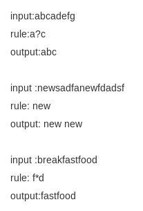
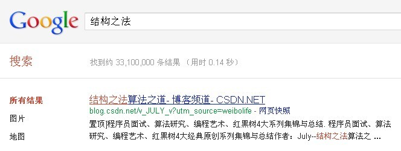

## 本章习题

**1、第一个只出现一次的字符**

在一个字符串中找到第一个只出现一次的字符。如输入abaccdeff，则输出b。

提示：这道题是2006年google 的一道笔试题。它在今年又出现了，不过换了一种形式。即最近的搜狐笔试大题：数组非常长，如何找到第一个只出现一次的数字，说明算法复杂度。此问题已经在程序员编程艺术系列第二章中有所阐述，在此不再作过多讲解。

代码，可编写如下：
```cpp
//查找第一个只出现一次的字符，第2个程序
//copyright@ yansha
//July、updated，2011.04.24.
char FirstNotRepeatChar(char* pString)
{
    if (!pString)
        return '\0';

    const int tableSize = 256;
    int hashTable[tableSize] = {0}; //存入数组，并初始化为0

    char* pHashKey = pString;
    while (*(pHashKey) != '\0')
        hashTable[*(pHashKey++)]++;

    while (*pString != '\0')
    {
        if (hashTable[*pString] == 1)
            return *pString;

        pString++;
    }
    return '\0';  //没有找到满足条件的字符，退出
}
```


**2、带通配符的字符串匹配问题**

字符串匹配问题：给定一个字符串，按照指定规则对其进行匹配，并将匹配的结果保存至output数组中。多个匹配项用空格间隔，最后一个不需要空格。  

要求：  

1. 匹配规则中包含通配符?和\*，其中?表示匹配任意一个字符，\*表示匹配任意多个（>=0）字符。  
2. 匹配规则要求匹配最大的字符子串，例如a\*d,匹配abbdd而非abbd,即最大匹配子串。  
3. 匹配后的输入串不再进行匹配，从当前匹配后的字符串重新匹配其他字符串。  

请实现函数：  
```c
  char* my_find(char input[], char rule[])
```

举例说明：  




**3、对称子字符串的最大长度**

题目：输入一个字符串，输出该字符串中对称的子字符串的最大长度。
比如输入字符串“google”，由于该字符串里最长的对称子字符串是“goog”，因此输出4。

提示：可能很多人都写过判断一个字符串是不是对称的函数，这个题目可以看成是该函数的加强版。

**4、实现memcpy函数**

已知memcpy的函数为： void* memcpy(void *dest , const void* src , size_t count)其中dest是目的指针，src是源指针。不调用c++/c的memcpy库函数，请编写memcpy。

分析：参考代码如下：
```cpp
//copyright@July 2013/9/24  
void* memcpy(void *dst, const void *src, size_t count)      
{      
    //安全检查  
    assert( (dst != NULL) && (src != NULL) );      
  
    unsigned char *pdst = (unsigned char *)dst;      
    const unsigned char *psrc = (const unsigned char *)src;      
  
    //防止内存重复  
    assert(!(psrc<=pdst && pdst<psrc+count));      
    assert(!(pdst<=psrc && psrc<pdst+count));      
  
    while(count--)      
    {      
        *pdst = *psrc;      
        pdst++;      
        psrc++;      
    }      
    return dst;      
}    
```


**5、实现memmove函数**

分析：memmove函数是<string.h>的标准函数，其作用是把从source开始的num个字符拷贝到destination。  
最简单的方法是直接复制，但是由于它们可能存在内存的重叠区，因此可能覆盖了原有数据。  比如当source+count>=dest&&source<dest时，dest可能覆盖了原有source的数据。  
解决办法是从后往前拷贝，对于其它情况，则从前往后拷贝。  

参考代码如下：
```cpp
//void * memmove ( void * destination, const void * source, size_t num );)  
 void* memmove(void* dest, void* source, size_t count)  
   {  
  
      void* ret = dest;  
  
      if (dest <= source || dest >= (source + count))  
       {  
          //正向拷贝  
         //copy from lower addresses to higher addresses  
         while (count --)  
             *dest++ = *source++;  
     }  
     else  
     {  
         //反向拷贝  
         //copy from higher addresses to lower addresses  
         dest += count - 1;  
         source += count - 1;  
  
         while (count--)  
             *dest-- = *source--;  
     }  
     return ret;  
 }  
```

**6、最短摘要生成**

你我在百度或谷歌搜索框中敲入本博客名称的前4个字“结构之法”，便能在第一个选项看到本博客的链接，如下图2所示：



在上面所示的图2中，搜索结果“结构之法算法之道-博客频道-CSDN.NET”下有一段说明性的文字：“程序员面试、算法研究、编程艺术、红黑树4大经典原创系列集锦与总结 作者：July--结构之法算法...”，我们把这段文字称为那个搜索结果的摘要，亦即最短摘要。我们的问题是，请问，这个最短摘要是怎么生成的呢?

提示：先把问题简化下：

给定一段产品的英文描述，包含M个英文字母，每个英文单词以空格分隔，无其他标点符号；再给定N个英文单词关键字，请说明思路并编程实现方法

    String extractSummary(String description,String[] key words)

目标是找出此产品描述中包含N个关键字（每个关键词至少出现一次）的长度最短的子串，作为产品简介输出（不限编程语言。

简单分析如下：

    @owen：扫描过程始终保持一个[left,right]的range,初始化确保[left,right]的range里包含所有关键字则停止。然后每次迭代：
    1.试图右移动left，停止条件为再移动将导致无法包含所有关键字。
    2.比较当前range's length和best length，更新最优值。
    3.右移right，停止条件为使任意一个关键字的计数+1。
    4.重复迭代。

更进一步，我们可以对问题进行如下的简化：

 - 假设给定的已经是经过网页分词之后的结果，词语序列数组为W。其中W[0], W[1],…, W[N]为一些已经分好的词语。
 - 假设用户输入的搜索关键词为数组Q。其中Q[0], Q[1],…, Q[m]为所有输入的搜索关键词。

这样，生成的最短摘要实际上就是一串相互联系的分词序列。比如从W[i]到W[j]，其中，0 < i < j<= N。例如上图所示的摘要“程序员面试、算法研究、编程艺术、红黑树4大经典原创吸了集锦与总结 作者：July--结构之法算法之道blog之博主.....”中包含了关键字——“结构之法”。

那么，我们该怎么做呢？请读者继续思考。

**7、翻转句子中单词的顺序**

输入一个英文句子，翻转句子中单词的顺序，但单词内字符的顺序不变。句子中单词以空格符隔开。为简单起见，标点符号和普通字母一样处理。

例如输入“I am a student.”，则输出“student. a am I”。

**8、编程判断俩个链表是否相交**

给出俩个单向链表的头指针，比如h1，h2，判断这俩个链表是否相交。为了简化问题，我们假设俩个链表均不带环。

问题扩展：
 - 如果链表可能有环列?
 - 如果需要求出俩个链表相交的第一个节点列?

**8、字符串的增删改查**

- 颠倒一个字符串。优化速度。优化空间。
。
- 找到一个子字符串。优化速度。优化空间。
- 比较两个字符串，用O(n)时间和恒量空间。
- 删除串中指定的字符。


**9**

输入一个链表的头结点，从尾到头反过来输出每个结点的值。链表结点定义如下：
```c
struct ListNode
{
      int       m_nKey;
      ListNode* m_pNext;
};
```

**10、在（1）时间内删除链表结点**

题目：给定链表的头指针和一个结点指针，在O(1)时间删除该结点。链表结点的定义如下：
```c
struct ListNode
{
      int        m_nKey;
      ListNode*  m_pNext;
};
```
函数的声明如下：
void DeleteNode(ListNode* pListHead, ListNode* pToBeDeleted);

*11、找出链表的第一个公共结点**

两个单向链表，找出它们的第一个公共结点。
链表的结点定义为：
```c
struct ListNode
{
      int         m_nKey;
      ListNode*   m_pNext;
};
```

**12、在字符串中删除特定的字符**

输入两个字符串，从第一字符串中删除第二个字符串中所有的字符。

例如，输入”They are students.”和”aeiou”，则删除之后的第一个字符串变成”Thy r stdnts.”。

**13**

在一篇英文文章中查找指定的人名，人名使用二十六个英文字母（可以是大写或小写）、空格以及两个通配符组成（*、?），通配符“*”表示零个或多个任意字母，通配符“?”表示一个任意字母。如：“J* Smi??” 可以匹配“John Smith” .

请用C语言实现如下函数：

void scan(const char* pszText, const char* pszName);

注：pszText为整个文章字符，pszName为要求匹配的英文名。

请完成些函数实现输出所有匹配的英文名，除了printf外，不能用第三方的库函数等。

**14**

char *str = "AbcABca";
写出一个函数，查找出每个字符的个数，区分大小写，要求时间复杂度是n（提示用ASCⅡ码）

**15**

给一篇文章，里面是由一个个单词组成，单词中间空格隔开，再给一个字符串指针数组，比如 char *str[]={"hello","world","good"};

求文章中包含这个字符串指针数组的最小子串。注意，只要包含即可，没有顺序要求。

提示：文章也可以理解为一个大的字符串数组，单词之前只有空格，没有标点符号。


**16**

给定一个字符串的集合，格式如：{aaa bbb ccc}， {bbb ddd}，{eee fff}，{ggg}，{ddd hhh}要求将其中交集不为空的集合合并，要求合并完成后的集合之间无交集，例如上例应输出{aaa bbb ccc ddd hhh}，{eee fff}， {ggg}。


**17**

五笔的编码范围是a ~ y的25个字母，从1位到4位的编码，如果我们把五笔的编码按字典序排序，形成一个数组如下：
    a, aa, aaa, aaaa, aaab, aaac, … …, b, ba, baa, baaa, baab, baac … …, yyyw, yyyx, yyyy
其中a的Index为0，aa的Index为1，aaa的Index为2，以此类推。
- 编写一个函数，输入是任意一个编码，比如baca，输出这个编码对应的Index；
- 编写一个函数，输入是任意一个Index，比如12345，输出这个Index对应的编码。

**18**

一个长度为10000的字符串，写一个算法，找出最长的重复子串，如abczzacbca,结果是bc。

提示：此题是后缀树/数组的典型应用，即是求后缀数组的height[]的最大值。


**19**

一个字符串，压缩其中的连续空格为1个后，对其中的每个字串逆序打印出来。比如"abc   efg  hij"打印为"cba gfe jih"。


**20**

输入一个字符串，如何求最大重复出现的字符串呢？比如输入ttabcftrgabcd,输出结果为abc，canffcancd,输出结果为can。

给定一个字符串，求出其最长的重复子串。
思路：使用后缀数组，对一个字符串生成相应的后缀数组后，然后再排序，排完序依次检测相邻的两个字符串的开头公共部分。
这样的时间复杂度为：

生成后缀数组 O(N)
排序 O(NlogN*N) 最后面的 N 是因为字符串比较也是 O(N)
依次检测相邻的两个字符串 O(N * N)
总的时间复杂度是 O(N^2*logN)


**21**

删除模式串中出现的字符，如“welcome to asted”,模式串为“aeiou”那么得到的字符串为“wlcm t std"，要求性能最优。


**22**

一个url指向的页面里面有另一个url,最终有一个url指向之前出现过的url或空，这两种情形都定义为null。这样构成一个单链表。给两条这样单链表，判断里面是否存在同样的url。url以亿级计，资源不足以hash。


**23、字符串的移动**

字符串为*号和26个字母的任意组合，把*号都移动到最左侧，把字母移到最右侧并保持相对顺序不变，要求时间和空间复杂度最小。


**24**
输入：
L:“shit”“fuck”“you”

S:“shitmeshitfuckyou”

输出：S中包含的L一个单词，要求这个单词只出现一次，如果有多个出现一次的，输出第一个这样的单词。


**24**

链表倒数第n个元素。

提示：设置一前一后两个指针，一个指针步长为1，另一个指针步长为n，当一个指针走到链表尾端时，另一指针指向的元素即为链表倒数第n个元素。


**25**

将一个很长的字符串，分割成一段一段的子字符串，子字符串都是回文字符串。有回文字符串就输出最长的，没有回文就输出一个一个的字符。

例如：

habbafgh

输出h,abba,f,g,h。

提示：一般的人会想到用后缀数组来解决这个问题。
