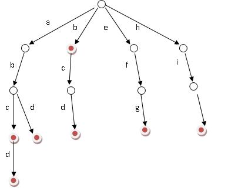

## Trie树（字典树）

### 1.1、什么是Trie树

Trie树，即字典树，又称单词查找树或键树，作为一种树形结构，可以理解为哈希树的变种。典型应用是用于统计和排序大量的字符串（但不仅限于字符串），所以经常被搜索引擎系统用于文本词频统计。它的优点是：最大限度地减少无谓的字符串比较，查询效率比哈希表高。

Trie的核心思想是空间换时间，利用字符串的公共前缀来降低查询时间的开销以达到提高效率的目的。

它有3个基本性质：

1. 根节点不包含字符，除根节点外每一个节点都只包含一个字符。
2. 从根节点到某一节点，路径上经过的字符连接起来，为该节点对应的字符串。
3. 每个节点的所有子节点包含的字符都不相同。

### 1.2、树的构建

咱们先来看一个问题：假如现在给你100000个长度不超过10的单词，对于每一个单词，我们要判断他出没出现过，如果出现了，求第一次出现在第几个位置。对于这个问题，我们该怎么解决呢？

如果我们用最傻的方法，对于每一个单词，我们都要去查找它前面的单词中是否有它。那么这个算法的复杂度就是O(n^2)。显然对于100000的范围难以接受。

换个思路想：假设我要查询的单词是abcd，那么在它前面的单词中，以b，c，d，f之类开头的显然不必考虑。而只要找以a开头的中是否存在abcd就可以了。同样的，在以a开头中的单词中，我们只要考虑以b作为第二个字母的，一次次缩小范围和提高针对性，这样一个树的模型就渐渐清晰了。
    
假设现在有b，abc，abd，bcd，abcd，efg，hii 这6个单词，那么我们可以构建一棵如下图所示的树：

如上图所示，对于每一个节点，从根遍历到他的过程就是一个单词，如果这个节点被标记为红色，就表示这个单词存在，否则不存在。
    
那么，对于一个单词，只要顺着他从根走到对应的节点，再看这个节点是否被标记为红色就可以知道它是否出现过了。把这个节点标记为红色，就相当于插入了这个单词。
    
这样一来我们查询和插入可以一起完成，所用时间仅仅为单词长度（在这个例子中，便是10）。这就是一棵trie树。
    
我们可以看到，trie树每一层的节点数是26^i级别的。所以为了节省空间，我们还可以用动态链表，或者用数组来模拟动态。而空间的花费，不会超过单词数×单词长度。

### 1.3、查询

咱们再来看另外一个问题：已知n个由小写字母构成的平均长度为10的单词,判断其中**是否存在某个串为另一个串的前缀子串**。

下面对比3种方法：

1. 最容易想到的：即从字符串集中从头往后搜，看每个字符串是否为字符串集中某个字符串的前缀，复杂度为O(n^2)。
2. 使用hash：我们用hash存下所有字符串的所有的前缀子串，建立存有子串hash的复杂度为O(n\*len)，而查询的复杂度为O(n)\* O(1)= O(n)。
3. 使用trie：因为当查询如字符串abc是否为某个字符串的前缀时，显然以b,c,d....等不是以a开头的字符串就不用查找了。所以建立trie的复杂度为O(n\*len)，而**建立\+查询在trie中是可以同时执行的**，建立的过程也就可以成为查询的过程，hash就不能实现这个功能。所以总的复杂度为O(n\*len)，实际查询的复杂度也只是O(len)。（说白了，就是**Trie树的平均高度h为len，所以Trie树的查询复杂度为O（h）=O（len）**。好比一棵二叉平衡树的高度为logN，则其查询，插入的平均时间复杂度亦为O（logN））。

Trie树是简单但实用的数据结构，通常用于实现字典查询。我们做即时响应用户输入的AJAX搜索框时，就是Trie开始。本质上，Trie是一颗存储多个字符串的树。相邻节点间的边代表一个字符，这样树的每条分支代表一则子串，而树的叶节点则代表完整的字符串。和普通树不同的地方是，相同的字符串前缀共享同一条分支。下面，再举一个例子。给出一组单词，inn, int, at, age, adv, ant, 我们可以得到下面的Trie：

可以看出：

- 每条边对应一个字母。
- 每个节点对应一项前缀。叶节点对应最长前缀，即单词本身。
- 单词inn与单词int有共同的前缀“in”, 因此他们共享左边的一条分支，root->i->in。同理，ate, age, adv, 和ant共享前缀"a"，所以他们共享从根节点到节点"a"的边。

查询操纵非常简单。比如要查找int，顺着路径i -> in -> int就找到了。

搭建Trie的基本算法也很简单，无非是逐一把每则单词的每个字母插入Trie。插入前先看前缀是否存在。如果存在，就共享，否则创建对应的节点和边。比如要插入单词add，就有下面几步：

1. 考察前缀"a"，发现边a已经存在。于是顺着边a走到节点a。
2. 考察剩下的字符串"dd"的前缀"d"，发现从节点a出发，已经有边d存在。于是顺着边d走到节点ad
3. 考察最后一个字符"d"，这下从节点ad出发没有边d了，于是创建节点ad的子节点add，并把边ad->add标记为d。

### 1.4、Trie树的应用

Trie树可以解决下述问题：

1、一个文本文件，大约有一万行，每行一个词，要求统计出其中最频繁出现的前10个词，请给出思想，给出时间复杂度分析。

分析：用trie树统计每个词出现的次数，时间复杂度是O(n\*le)（le表示单词的平均长度），然后是找出出现最频繁的前10个词。也可以用堆来实现（具体的操作可参考第三章、寻找最小的k个数），时间复杂度是O(n\*lg10)。所以总的时间复杂度，是O(n\*le)与O(n\*lg10)中较大的哪一个。

2、一个1G大小的一个文件，里面每一行是一个词，词的大小不超过16字节，内存限制大小是1M。返回频数最高的100个词。

3、000万字符串，其中有些是重复的，需要把重复的全部去掉，保留没有重复的字符串。请怎么设计和实现？

4、本文件，大约有一万行，每行一个词，要求统计出其中最频繁出现的前10个词，请给出思想，给出时间复杂度分析。

5、寻找热门查询
搜索引擎会通过日志文件把用户每次检索使用的所有检索串都记录下来，每个查询串的长度为1-255字节。假设目前有一千万个记录，这些查询串的重复读比较高，虽然总数是1千万，但是如果去除重复和，不超过3百万个。一个查询串的重复度越高，说明查询它的用户越多，也就越热门。请你统计最热门的10个查询串，要求使用的内存不能超过1G。  
(1) 请描述你解决这个问题的思路；  
(2) 请给出主要的处理流程，算法，以及算法的复杂度。
