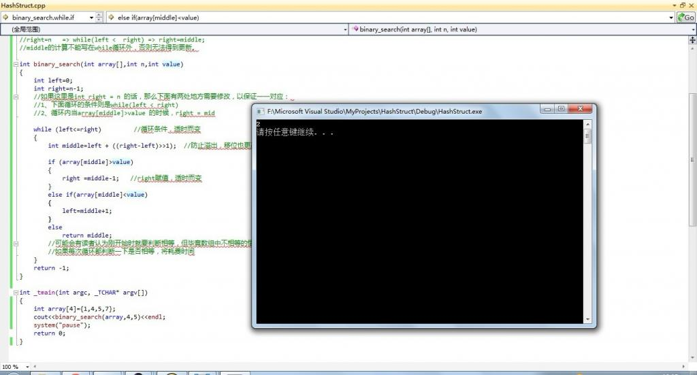

# 第二十五章：二分查找实现

作者：July

出处：结构之法算法之道

## 引言

Jon Bentley：90%以上的程序员无法正确无误的写出二分查找代码。也许很多人都早已听说过这句话，但我还是想引用《编程珠玑》上的如下几段文字：

二分查找可以解决（预排序数组的查找）问题：只要数组中包含T（即要查找的值），那么通过不断缩小包含T的范围，最终就可以找到它。一开始，范围覆盖整个数组。将数组的中间项与T进行比较，可以排除一半元素，范围缩小一半。就这样反复比较，反复缩小范围，最终就会在数组中找到T，或者确定原以为T所在的范围实际为空。对于包含N个元素的表，整个查找过程大约要经过log(2)N次比较。

多数程序员都觉得只要理解了上面的描述，写出代码就不难了；但事实并非如此。如果你不认同这一点，最好的办法就是放下书本，自己动手写一写。试试吧。

我在贝尔实验室和IBM的时候都出过这道考题。那些专业的程序员有几个小时的时间，可以用他们选择的语言把上面的描述写出来；写出高级伪代码也可以。考试结束后，差不多所有程序员都认为自己写出了正确的程序。于是，我们花了半个钟头来看他们编写的代码经过测试用例验证的结果。几次课，一百多人的结果相差无几：90%的程序员写的程序中有bug（我并不认为没有bug的代码就正确）。

我很惊讶：在足够的时间内，只有大约10%的专业程序员可以把这个小程序写对。但写不对这个小程序的还不止这些人：高德纳在《计算机程序设计的艺术 第3卷 排序和查找》第6.2.1节的“历史与参考文献”部分指出，虽然早在1946年就有人将二分查找的方法公诸于世，但直到1962年才有人写出没有bug的二分查找程序。 ”——乔恩·本特利，《编程珠玑（第1版）》第35-36页。

**你能正确无误的写出二分查找代码么？不妨一试。**

## 二分查找代码

二分查找的原理想必不用多解释了，不过有一点必须提醒读者的是，二分查找是针对的排好序的数组。OK，纸上读来终觉浅，觉知此事要躬行。我先来写一份，下面是我写的一份二分查找的实现（之前去某一家公司面试也曾被叫当场实现二分查找，不过结果可能跟你一样，当时就未能完整无误写出），有任何问题或错误，恳请不吝指正：

```cpp
//二分查找V0.1实现版
//copyright@2011 July

//首先要把握下面几个要点：
//right = n-1 => while(left <= right) => right = middle-1;
//right = n   => while(left <  right) => right = middle;
//middle的计算不能写在while循环外，否则无法得到更新。

int binary_search(int array[], int n, int value)
{
    int left = 0;
    int right = n - 1;
    //如果这里是int right = n 的话，那么下面有两处地方需要修改，以保证一一对应：
    //1、下面循环的条件则是while(left < right)
    //2、循环内当 array[middle] > value 的时候，right = mid

    while (left <= right)  //循环条件，适时而变
    {
        int middle = left + ((right - left) >> 1);  //防止溢出，移位也更高效。同时，每次循环都需要更新。

        if (array[middle] > value)
        {
            right = middle - 1;  //right赋值，适时而变
        }
        else if(array[middle] < value)
        {
            left = middle + 1;
        }
        else
            return middle;
        //可能会有读者认为刚开始时就要判断相等，但毕竟数组中不相等的情况更多
        //如果每次循环都判断一下是否相等，将耗费时间
    }
    return -1;
}
```

简单测试下，运行结果如下所示（当然，一次测试正确不代表程序便0 bug了，且测试深度远远不够）：



## 测试

也许你之前已经把二分查找实现过很多次了，但现在不妨再次测试一下。关闭所有网页，窗口，打开记事本，或者编辑器，或者直接在本文评论下，不参考上面我写的或其他任何人的程序，给自己十分钟到N个小时不等的时间，立即编写一个二分查找程序。

当然，能正确写出来不代表任何什么，不能正确写出来亦不代表什么，仅仅针对Jon Bentley的言论做一个简单的测试而已。

## 总结

本文发表后，马上就有很多朋友自己尝试了。根据从朋友们在本文评论下留下的代码，发现出错率最高的在以下这么几个地方：

注释里已经说得很明白了，可还是会有不少朋友犯此类的错误：

    首先要把握下面几个要点：
    right = n-1 => while(left <= right) => right = middle-1;
    middle的计算不能写在while循环外，否则无法得到更新。

还有一个最最常犯的错误，具体可以参考[Extra, Extra - Read All About It: Nearly All Binary Searches and Mergesorts are Broken](http://googleresearch.blogspot.com/2006/06/extra-extra-read-all-about-it-nearly.html)，其中提到了JDK5中该BUG：

    middle = (left+right)>>1; 这样的话left与right的值比较大的时候，其和可能溢出。

这个也是错误的:

    right = n   => while(left <  right) => right = middle;
  如果搜索数组中不存在的数字的时候,可能会导致死循环.
  因为最后left = middle, right = middle + 1,这样每次更新left和middle总是不变的.

## 扩展

二分查找时： `left <= right，right = middle - 1;left < right，right = middle;`

```c
//算法所操作的区间,是左闭右开区间,还是左闭右闭区间,这个区间,需要在循环初始化,
//循环体是否终止的判断中,以及每次修改left,right区间值这三个地方保持一致,否则就可能出错.

//二分查找实现一
int search(int array[], int n, int v)
{
    int left, right, middle;

    left = 0, right = n - 1;

    while (left <= right)
    {
        middle = left + (right - left) / 2;
        if (array[middle] > v)
        {
            right = middle - 1;
        }
        else if (array[middle] < v)
        {
            left = middle + 1;
        }
        else
        {
            return middle;
        }
    }

    return -1;
}

//二分查找实现二
int search(int array[], int n, int v)
{
    int left, right, middle;

    left = 0, right = n;

    while (left < right)
    {
        middle = left + (right - left) / 2;

        if (array[middle] > v)
        {
            right = middle;
        }
        else if (array[middle] < v)
        {
            left = middle + 1;
        }
        else
        {
            return middle;
        }
    }

    return -1;
}
```
