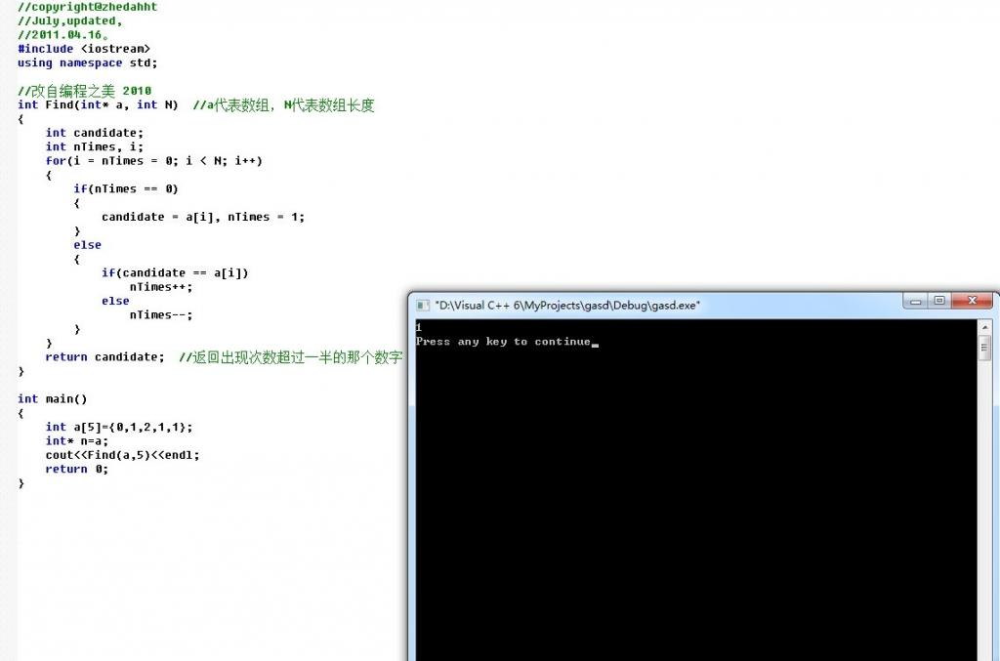

# 第二十一章：出现次数超过一半的数字


##题目描述

题目：数组中有一个数字出现的次数超过了数组长度的一半，找出这个数字。

分析：编程之美上也有这道题，不过它变换了题目的表述形式，如下：

Tango是微软亚洲研究院的一个试验项目，如图1所示。研究院的员工和实习生们都很喜欢在Tango上面交流灌水。传说，Tango有一大“水王”，他不但喜欢发帖，还会回复其他ID发的每个帖子。坊间风闻该“水王”发帖数目超过了帖子总数的一半。如果你有一个当前论坛上所有帖子（包括回帖）的列表，其中帖子作者的ID也在表中，你能快速找出这个传说中的Tango水王吗？


图1  Tango

一个数组中有很多数，现在我们要找出其中那个出现次数超过总数一半的数字，怎么找呢?大凡当我们碰到某一个杂乱无序的东西时，我们人的内心本质期望是希望把它梳理成有序的。所以，我们得分两种情况来讨论，无序和有序。

## 解法一

如果**无序**，那么我们是不是可以先把数组中所有这些数字**先进行排序**，至于选取什么排序方法则不在话下，最常用的快速排序O（N*logN）即可。排完序呢，直接遍历。在遍历整个数组的同时统计每个数字的出现次数，然后把那个出现次数超过一半的数字直接输出，题目便解答完成了。总的时间复杂度为O（N*logN+N）。

## 解法二
但各位再想想，**如果是有序的数组呢**或者经过上述由无序的数组变成有序后的数组呢？是否在排完序O（N*logN）后，真的还需要再遍历一次整个数组么?我们知道，既然是数组的话，那么我们可以根据数组索引支持直接定向到某一个数。我们发现，一个数字在数组中的出现次数超过了一半，那么在已排好序的数组索引的N/2处（从零开始编号），就一定是这个数字。自此，我们只需要对整个数组排完序之后，然后直接输出数组中的第N/2处的数字即可，这个数字即是整个数组中出现次数超过一半的数字，总的时间复杂度由于少了最后一次整个数组的遍历，缩小到O（N*logN）。

## 解法三
然不论是上述思路一的O（N*logN+N），还是思路二的O（N*logN），时间复杂度并无本质性的改变。我们需要找到一种更为有效的思路或方法。既要缩小总的时间复杂度，那么就用查找时间复杂度为O（1），事先预处理时间复杂度为O（N）的**hash表**。哈希表的键值（Key）为数组中的数字，值（Value）为该数字对应的次数。然后直接遍历整个**hash表**，找出每一个数字在对应的位置处出现的次数，输出那个出现次数超过一半的数字即可。
 
## 解法四
Hash表需要O（N）的空间开销，且要设计hash函数，还有没有更好的办法呢?我们可以试着这么考虑，如果**每次删除两个不同的数**（不管是不是我们要查找的那个出现次数超过一半的数字），那么，在剩下的数中，我们要查找的数（出现次数超过一半）出现的次数仍然超过总数的一半。通过不断重复这个过程，不断排除掉其它的数，最终找到那个出现次数超过一半的数字。这个方法，免去了上述思路一、二的排序，也避免了思路三空间O（N）的开销，总得说来，时间复杂度只有O（N），空间复杂度为O（1），不失为最佳方法。

或许，你还没有明白上述思路4的意思，举个简单的例子吧，如数组a[5]={0,1,2,1,1};

很显然，若我们要找出数组a中出现次数超过一半的数字，这个数字便是1，若根据上述思路4所述的方法来查找，我们应该怎么做呢?通过一次性遍历整个数组，然后每次删除不相同的两个数字，过程如下简单表示：

    0 1 2 1 1 =>2 1 1=>1,最终，1即为所找。

但是如果是5，5，5，5，1，还能运用上述思路么？额，别急，请看下文思路5。

## 解法五
咱们根据数组的特性进一步考虑@zhedahht： 数组中有个数字出现的次数超过了数组长度的一半。也就是说，有个数字出现的次数比其他所有数字出现次数的和还要多。因此我们可以考虑在遍历数组的时候保存两个值：一个是数组中的一个数字，一个是次数。当我们遍历到下一个数字的时候，如果下一个数字和我们之前保存的数字相同，则次数加1。如果下一个数字和我们之前保存的数字不同，则次数减1。如果次数为零，我们需要保存下一个数字，并把次数重新设为1。

下面，举二个例子：

* 第一个例子，5，5，5，5，1 ：

    不同的相消，相同的累积。遍历到第四个数字时，candidate 是5, nTimes 是4;    遍历到第五个数字时，candidate 是5, nTimes 是3;  nTimes不为0，那么candidate就是超过半数的。

* 第二个例子，0，1，2，1，1 :

    开始时，保存candidate是数字0，nTimes为1；遍历到数字1后，与数字0不同，则nTimes减1变为零；接下来，遍历到数字2，2与1不同，candidate保存数字2，且nTimes重新设为1；继续遍历到第4个数字1时，与2不同，nTimes减1为零，同时candidate保存为1；最终遍历到最后一个数字还是1，与我们之前candidate保存的数字1相同，nTimes加1为1。最后返回的是之前保存的candidate为1。



针对上述程序，我再说详细点，0，1，2，1，1 ：

    i=0，candidate=0，nTimes=1；
    i=1，a[1] != candidate，nTimes--，=0；
    i=2，candidate=2，nTimes=1；
    i=3，a[3] != candidate，nTimes--，=0；
    i=4，candidate=1，nTimes=1；
    如果是0，1，2，1，1，1的话，那么i=5，a[5] == candidate，nTimes++，=2；......

ok，思路清楚了，完整的代码如下：

```c
//改自编程之美 2010  
Type Find(Type* a, int N)  //a代表数组，N代表数组长度  
{  
    Type candidate;  
    int nTimes, i;  
    for(i = nTimes = 0; i < N; i++)  
    {  
        if(nTimes == 0)  
        {  
            candidate = a[i], nTimes = 1;  
        }  
        else  
        {  
            if(candidate == a[i])  
                nTimes++;  
            else  
                nTimes--;  
        }  
    }  
    return candidate;   
}
```

或者：

```cpp
//copyright@zhedahht  
//July,updated,  
//2011.04.16。  
#include <iostream>  
using namespace std;  
  
bool g_Input = false;  
  
int Num(int* numbers, unsigned int length)  
{  
    if(numbers == NULL && length == 0)  
    {  
        g_Input = true;  
        return 0;  
    }  
    g_Input = false;  
      
    int result = numbers[0];  
    int times = 1;  
    for(int i = 1; i < length; ++i)  
    {  
        if(numbers[i] == result)  
            times++;  
        else  
            times--;  
        if(times == 0)  
        {  
            result = numbers[i];  
            times = 1;  
        }  
    }  
      
    //检测输入是否有效。  
    times = 0;  
    for(i = 0; i < length; ++i)  
    {  
        if(numbers[i] == result)  
            times++;  
    }  
    if(times * 2 <= length)  
        //检测的标准是：如果数组中并不包含这么一个数字，那么输入将是无效的。  
    {  
        g_Input = true;  
        result = 0;  
    }      
    return result;  
}  
  
int main()  
{  
    int a[10]={1,2,3,4,6,6,6,6,6};  
    int* n=a;  
    cout<<Num(a,9)<<endl;  
    return 0;  
}
```

这段代码与上段代码本质上并无二致，不过有几个问题，还是需要我们注意：

**1.**当输入无效性时，要处理。比如数组长度为0。

**2.**最后，上述代码加了一个判断，如果数组中并不包含这么一个数字，那么输入也是无效的。因此在函数结束前还加了一段代码来验证输入是不是有效的。

##问题扩展
加强版水王.找出出现次数刚好是一半的数字

我们知道，水王问题：有N个数，其中有一个数出现超过一半，要求在线性时间求出这个数。那么，我的问题是，加强版水王：有N个数，其中有一个数刚好出现一半次数，要求在线性时间内求出这个数。

因为，很明显，如果是刚好出现一半的话，如此例： 0，1，2，1 ：

    遍历到0时，candidate为0，times为1
    遍历到1时，与candidate不同，times减为0
    遍历到2时，times为0，则candidate更新为2，times加1
    遍历到1时，与candidate不同，则times减为0；我们需要返回所保存candidate（数字2）的下一个数字，即数字1。

所以，如果还运用上面的程序的话，那么只能返回我们要找的数字1的前一个数字，即遍历到1之前所保存的candidate=2，试问如何让程序能返回我们需要的数字1呢？望读者思考之。

赤血红狐&&pointersky用了两个变量来记录水王，最终完整代码如下（测试正确）：

```cpp
#include<iostream>  
using namespace std;  
  
int Find(int* a, int N)  
{  
    int candidate1, candidate2;  
    int nTimes1, nTimes2, i;  
          
    for(i = nTimes1 = nTimes2 = 0; i < N; i++)  
    {  
        if(nTimes1 == 0)  
        {  
            candidate1 = a[i], nTimes1 = 1;  
        }  
        else if(nTimes2 == 0 && candidate1 != a[i])  
        //注意：这里的判断条件加上第二个变量是否等于第一个变量的判断  
        {  
              
            candidate2 = a[i], nTimes2 = 1;  
        }  
        else  
        {  
            if(candidate1 == a[i])  
                nTimes1++;  
            else if(candidate2 == a[i])  
                nTimes2++;  
            else  
            {  
                nTimes1--;  
                nTimes2--;  
            }  
        }  
    }  
    return nTimes1>nTimes2?candidate1:candidate2;  
}  
  
int main()  
{  
    int a[4]={0,1,2,1};  
    cout<<Find(a,4)<<endl;  
//  int a[6]={1,0,2,1,2,1};  
//  cout<<Find(a,6)<<endl;  
}
```

当然也可以如[本文](http://blog.csdn.net/v_july_v/article/details/6890054)评论下第16楼dalong7所述：

    易知总数必定是偶数，同时删除不同数字，最后剩余的两个数字必有其一为水王，只需简单判断一下即可

代码如下（测试正确）：

```c
int Find(int* a, int N)  //a代表数组，N代表数组长度      
{      
    int candidate;      
    int nTimes, i;      
    for(i = nTimes = 0; i < N; i++)      
    {      
        if(nTimes == 0)      
        {      
            candidate = a[i], nTimes = 1;      
        }      
        else      
        {      
            if(candidate == a[i])      
                nTimes++;      
            else      
                nTimes--;      
        }      
    }      
    
    int cTimes = 0;    
    int candidate2 = a[N-1];    
    for(i = 0; i < N; i ++)    
    {    
        if(a[i] == candidate)    
        {    
            cTimes++;    
        }    
    }    
    
    return cTimes == N/2 ? candidate : candidate2;       
}
```
## 继续深入

**1. 谁是选举中得票超半数的人？**

美国选举一般要求找到票数超过一半的人。于是有人就开始研究如何用线性时间找到这个人或者证明这个人不存在。Robert S. Boyer 和 J Strother Moore 发表了一片关于这个算法的论文。内容和上文提到的算法是一致的，只是多了理论分析和FORTRAN实现部分。


MJRTY - A Fast Majority Vote Algorithm, with R.S. Boyer. In R.S. Boyer (ed.), Automated Reasoning: Essays in Honor of Woody Bledsoe, Automated Reasoning Series, Kluwer Academic Publishers, Dordrecht, The Netherlands, 1981, pp. 105-117. 

**2. 链接**

论文链接：http://citeseerx.ist.psu.edu/viewdoc/download?doi=10.1.1.56.3439&rep=rep1&type=pdf

作者J Strother Moore关于这个算法的网址（英文）：http://www.cs.utexas.edu/~moore/best-ideas/mjrty/index.html
