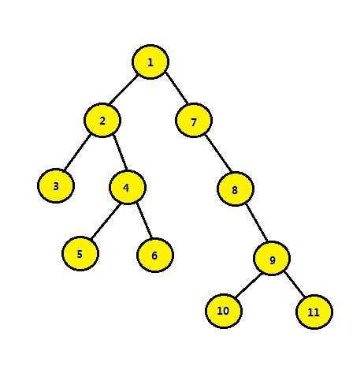
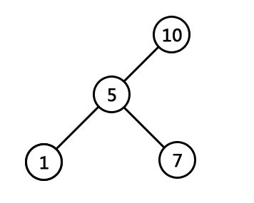
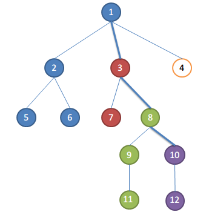
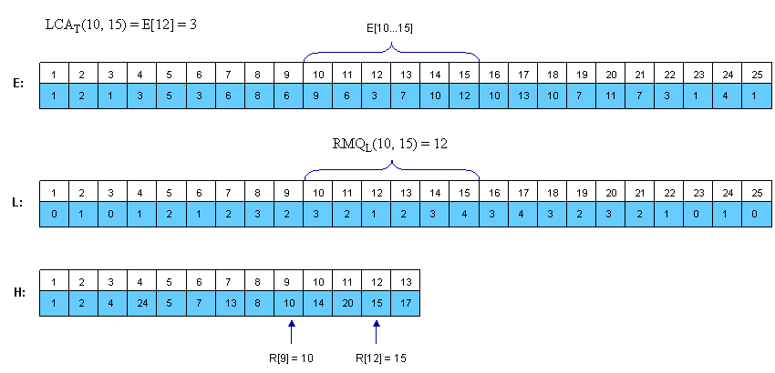
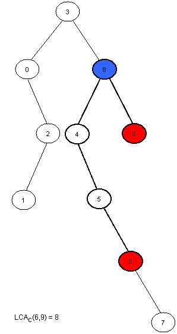
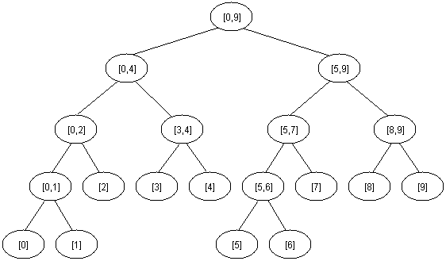

# 最近公共祖先LCA问题

## 问题描述

求有根树的任意两个节点的最近公共祖先。

## 分析与解法

解答这个问题之前，咱们得先搞清楚到底什么是最近公共祖先。最近公共祖先简称LCA（Lowest Common Ancestor），所谓LCA，是当给定一个有根树T时，对于任意两个结点u、v，找到一个离根最远的结点x，使得x同时是u和v的祖先，x 便是u、v的最近公共祖先。（参见：http://en.wikipedia.org/wiki/Lowest_common_ancestor）原问题涵盖一般性的有根树，本文为了简化，多使用二叉树来讨论。

举个例子，如针对下图所示的一棵普通的二叉树来讲：



结点3和结点4的最近公共祖先是结点2，即LCA（3 4）=2 。在此，需要注意到当两个结点在同一棵子树上的情况，如结点3和结点2的最近公共祖先为2，即 LCA（3 2）=2。同理：LCA（5 6）=4，LCA（6 10）=1。

明确了题意，咱们便来试着解决这个问题。一般文章的做法，可能是针对是否为二叉查找树分情况讨论，想必这也是一般人最先想到的思路。除此之外，还有所谓的Tarjan算法、倍增算法、以及转换为RMQ问题（求某段区间的极值）。

### 解法一：暴力对待

#### 1.1、是二叉查找树

在当这棵树是二叉查找树的情况下，如下图：



那么从树根开始：

* 如果当前结点t 大于结点u、v，说明u、v都在t 的左侧，所以它们的共同祖先必定在t 的左子树中，故从t 的左子树中继续查找；
* 如果当前结点t 小于结点u、v，说明u、v都在t 的右侧，所以它们的共同祖先必定在t 的右子树中，故从t 的右子树中继续查找；
* 如果当前结点t 满足 u <t < v，说明u和v分居在t 的两侧，故当前结点t 即为最近公共祖先；
* 而如果u是v的祖先，那么返回u的父结点，同理，如果v是u的祖先，那么返回v的父结点。

代码如下所示：

```cpp
//copyright@eriol 2011  
//modified by July 2014  
public int query(Node t, Node u, Node v) {    
    int left = u.value;    
    int right = v.value;    
    Node parent = null;    
  
    //二叉查找树内，如果左结点大于右结点，不对，交换  
    if (left > right) {    
        int temp = left;    
        left = right;    
        right = temp;    
    }    
  
    while (true) {    
        //如果t小于u、v，往t的右子树中查找  
        if (t.value < left) {    
            parent = t;    
            t = t.right;    
  
        //如果t大于u、v，往t的左子树中查找  
        } else if (t.value > right) {    
            parent = t;    
            t = t.left;    
        } else if (t.value == left || t.value == right) {    
            return parent.value;    
        } else {    
            return t.value;    
        }    
    }    
}  
```
  
#### 1.2、不是二叉查找树

但如果这棵树不是二叉查找树，只是一棵普通的二叉树呢？如果每个结点都有一个指针指向它的父结点，于是我们可以从任何一个结点出发，得到一个到达树根结点的单向链表。因此这个问题转换为两个单向链表的第一个公共结点。

此外，如果给出根节点，LCA问题可以用递归很快解决。而关于树的问题一般都可以转换为递归（因为树本来就是递归描述），参考代码如下：

```cpp
//copyright@allantop 2014-1-22-20:01  
node* getLCA(node* root, node* node1, node* node2)  
{  
    if(root == null)  
        return null;  
    if(root== node1 || root==node2)  
        return root;  
  
    node* left = getLCA(root->left, node1, node2);  
    node* right = getLCA(root->right, node1, node2);  
  
    if(left != null && right != null)  
        return root;  
    else if(left != null)  
        return left;  
    else if (right != null)  
        return right;  
    else   
        return null;  
}  
```

然不论是针对普通的二叉树，还是针对二叉查找树，上面的解法有一个很大的弊端就是：如需N 次查询，则总体复杂度会扩大N 倍，故这种暴力解法仅适合一次查询，不适合多次查询。

接下来的解法，将不再区别对待是否为二叉查找树，而是一致当做是一棵普通的二叉树。总体来说，由于可以把LCA问题看成是询问式的，即给出一系列询问，程序对每一个询问尽快做出反应。故处理这类问题一般有两种解决方法：

* 一种是在线算法，相当于循序渐进处理；
* 另外一种则是离线算法，如Tarjan算法，相当于一次性批量处理，一开始就知道了全部查询，只待询问。

### 解法二：Tarjan算法

如上文末节所述，不论咱们所面对的二叉树是二叉查找树，或不是二叉查找树，都可以把求任意两个结点的最近公共祖先，当做是查询的问题，如果是只求一次，则是单次查询；如果要求多个任意两个结点的最近公共祖先，则相当于是批量查询。

涉及到批量查询的时候，咱们可以借鉴离线处理的方式，这就引出了解决此LCA问题的Tarjan离线算法。

#### 2.1、什么是Tarjan算法

Tarjan算法 （以发现者Robert Tarjan命名）是一个在图中寻找强连通分量的算法。算法的基本思想为：任选一结点开始进行深度优先搜索dfs（若深度优先搜索结束后仍有未访问的结点，则再从中任选一点再次进行）。搜索过程中已访问的结点不再访问。搜索树的若干子树构成了图的强连通分量。

应用到咱们要解决的LCA问题上，则是：对于新搜索到的一个结点u，先创建由u构成的集合，再对u的每颗子树进行搜索，每搜索完一棵子树，这时候子树中所有的结点的最近公共祖先就是u了。

举一个例子，如下图（不同颜色的结点相当于不同的集合）：



假设遍历完10的孩子,要处理关于10的请求了，取根节点到当前正在遍历的节点的路径为关键路径,即1-3-8-10，集合的祖先便是关键路径上距离集合最近的点。

比如：

* 1，2，5，6为一个集合,祖先为1，集合中点和10的LCA为1
* 3，7为一个集合，祖先为3，集合中点和10的LCA为3
* 8，9，11为一个集合，祖先为8，集合中点和10的LCA为8
* 10，12为一个集合，祖先为10，集合中点和10的LCA为10

得出的结论便是：LCA(u,v)便是根至u的路径上到节点v最近的点。

#### 2.2、Tarjan算法如何而来

但关键是 Tarjan算法是怎么想出来的呢？再给定下图，你是否能看出来：分别从结点1的左右子树当中，任取一个结点，设为u、v，这两个任意结点u、v的最近公共祖先都为1。


于此，我们可以得知：若两个结点u、v分别分布于某节点t 的左右子树，那么此节点 t即为u和v的最近公共祖先。更进一步，考虑到一个节点自己就是LCA的情况，得知：

* 若某结点t 是两结点u、v的祖先之一，且这两结点并不分布于该结点t 的一棵子树中，而是分别在结点t 的左子树、右子树中，那么该结点t 即为两结点u、v的最近公共祖先。

这个定理就是Tarjan算法的基础。

一如上文1.1节我们得到的结论：“如果当前结点t 满足 u <t < v，说明u和v分居在t 的两侧，故当前结点t 即为最近公共祖先”。

而对于本节开头我们所说的“如果要求多个任意两个结点的最近公共祖先，则相当于是批量查询”，即在很多组的询问的情况下，或许可以先确定一个LCA。例如是根节点1，然后再去检查所有询问，看是否满足刚才的定理，不满足就忽视，满足就赋值，全部弄完，再去假设2号节点是LCA，再去访问一遍。

可此方法需要判断一个结点是在左子树、还是右子树，或是都不在，都只能遍历一棵树，而多次遍历的代价实在是太大了，所以我们需要找到更好的方法。这就引出了下面要阐述的Tarjan算法，即每个结点只遍历一次，怎么做到的呢，请看下文讲解。

### 2.3、Tarjan算法流程

Tarjan算法流程为：

```
Procedure dfs（u）；
	begin
		设置u号节点的祖先为u
		若u的左子树不为空，dfs（u - 左子树）；
		若u的右子树不为空，dfs（u - 右子树）；
		访问每一条与u相关的询问u、v
			-若v已经被访问过，则输出v当前的祖先t（t即u,v的LCA）
		标记u为已经访问，将所有u的孩子包括u本身的祖先改为u的父亲
	end
```

普通的dfs 不能直接解决LCA问题，故Tarjan算法的原理是dfs + [并查集](http://zh.wikipedia.org/zh-cn/%E5%B9%B6%E6%9F%A5%E9%9B%86)，它每次把两个结点对的最近公共祖先的查询保存起来，然后dfs 更新一次。如此，利用并查集优越的时空复杂度，此算法的时间复杂度可以缩小至O(n＋Q)，其中，n为数据规模，Q为询问个数。

### 解法三：转换为RMQ问题

解决此最近公共祖先问题的还有一个算法，即转换为RMQ问题，用Sparse Table（简称ST）算法解决。

### 3.1、什么是RMQ问题

RMQ，全称为Range Minimum Query，顾名思义，则是区间最值查询，它被用来在数组中查找两个指定索引中最小值的位置。即RMQ相当于给定数组A[0, N-1]，找出给定的两个索引如 i、j 间的最小值的位置。

假设一个算法预处理时间为 f(n)，查询时间为g(n)，那么这个算法复杂度的标记为<f(n), g(n)>。我们将用RMQA(i, j) 来表示数组A 中索引i 和 j 之间最小值的位置。 u和v的离树T根结点最远的公共祖先用LCA T(u, v)表示。

如下图所示，RMQA(2,7 )则表示求数组A中从A[2]~A[7]这段区间中的最小值：


很显然，从上图中，我们可以看出最小值是A[3] = 1，所以也就不难得出最小值的索引值RMQA(2,7) = 3。

#### 3.2、如何解决RMQ问题

##### 3.2.1、Trivial algorithms for RMQ

下面，我们对对每一对索引(i, j)，将数组中索引i 和 j 之间最小值的位置 RMQA(i, j) 存储在M[0, N-1][0, N-1]表中。 RMQA(i, j) 有不同种计算方法，你会看到，随着计算方法的不同，它的时空复杂度也不同：

* 普通的计算将得到一个<O(N^3), O(1)> 复杂度的算法。尽管如此，通过使用一个简单的动态规划方法，我们可以将复杂度降低到<O(N^2), O(1)>。如何做到的呢？方法如下代码所示：

```cpp
//copyright@  
//modified by July 2014  
void process1(int M[MAXN][MAXN], int A[MAXN], int N)  
{  
    int i, j;  
    for (i =0; i < N; i++)  
        M[i][i] = i;  
  
    for (i = 0; i < N; i++)  
        for (j = i + 1; j < N; j++)  
            //若前者小于后者，则把后者的索引值付给M[i][j]  
            if (A[M[i][j - 1]] < A[j])  
                M[i][j] = M[i][j - 1];  
            //否则前者的索引值付给M[i][j]  
            else  
                M[i][j] = j;  
}  
```

* 一个比较有趣的点子是把向量分割成sqrt(N)大小的段。我们将在M[0,sqrt(N)-1]为每一个段保存最小值的位置。如此，M可以很容易的在O(N)时间内预处理。


* 一个更好的方法预处理RMQ 是对2^k 的长度的子数组进行动态规划。我们将使用数组M[0, N-1][0, logN]进行保存，其中M[ i ][ j ] 是以i 开始，长度为 2^j 的子数组的最小值的索引。这就引出了咱们接下来要介绍的Sparse Table (ST) algorithm。

##### 3.2.2、Sparse Table (ST) algorithm 


在上图中，我们可以看出：
* 在A[1]这个长度为2^0的区间内，最小值即为A[1] = 4，故最小值的索引M[1][0]为1；
* 在A[1]、A[2] 这个长度为2^1的区间内，最小值为A[2] = 3，故最小值的索引为M[1][1] = 2；
* 在A[1]、A[2]、A[3]、A[4]这个长度为2^2的区间内，最小值为A[3] = 1，故最小值的索引M[1][2] = 3。

为了计算M[i][j]我们必须找到前半段区间和后半段区间的最小值。很明显小的片段有着2^(j-1)长度，因此递归如下  


根据上述公式，可以写出这个预处理的递归代码，如下：

```cpp
void process2(int M[MAXN][LOGMAXN], int A[MAXN], int N)  
{  
    int i, j;  
    //initialize M for the intervals with length 1  
  
    for (i = 0; i < N; i++)  
        M[i][0] = i;  
  
    //compute values from smaller to bigger intervals  
    for (j = 1; 1 << j <= N; j++)  
        for (i = 0; i + (1 << j) - 1 < N; i++)  
            if (A[M[i][j - 1]] < A[M[i + (1 << (j - 1))][j - 1]])  
                M[i][j] = M[i][j - 1];  
            else  
                M[i][j] = M[i + (1 << (j - 1))][j - 1];  
}
```

经过这个O(N logN)时间复杂度的预处理之后，让我们看看怎样使用它们去计算 RMQA(i, j)。思路是选择两个能够完全覆盖区间[i..j]的块并且找到它们之间的最小值。设k = [log(j - i + 1)]。

为了计算 RMQA(i, j)，我们可以使用下面的公式：


故，综合来看，咱们预处理的时间复杂度从O(N3)降低到了O(N logN)，查询的时间复杂度为O(1)，所以最终的整体复杂度为：< O(N logN), O(1) >。

#### 3.3、LCA与RMQ的关联性

现在，让我们看看怎样用RMQ来计算LCA查询。事实上，我们可以在线性时间里将LCA问题规约到RMQ问题，因此每一个解决RMQ的问题都可以解决LCA问题。让我们通过例子来说明怎么规约的：

 


注意LCAT(u, v)是在对T进行dfs过程当中在访问u和v之间离根结点最近的点。因此我们可以考虑树的欧拉环游过程u和v之间所有的结点，并找到它们之间处于最低层的结点。为了达到这个目的，我们可以建立三个数组：

* E[1, 2*N-1]  - 对T进行欧拉环游过程中所有访问到的结点;E[i]是在环游过程中第i个访问的结点
* L[1,2*N-1] -  欧拉环游中访问到的结点所处的层数;L[i]是E[i]所在的层数
* H[1, N] - H[i] 是E中结点i第一次出现的下标(任何出现i的地方都行，当然选第一个不会错)

假定H[u]<H[v](否则你要交换u和v)。可以很容易的看到u和v第一次出现的结点是E[H[u]..H[v]]。现在，我们需要找到这些结点中的最低层。为了达到这个目的，我们可以使用RMQ。因此 LCAT(u, v) = E[RMQL(H[u], H[v])] ,RMQ返回的是索引，下面是E,L,H数组：



注意L中连续的元素相差为1。

### 3.4、从RMQ到LCA

我们已经看到了LCA问题可以在线性时间规约到RMQ问题。现在让我们来看看怎样把RMQ问题规约到LCA。这个意味着我们实际上可以把一般的RMQ问题规约到带约束的RMQ问题(这里相邻的元素相差1)。为了达到这个目的，我们需要使用笛卡尔树。

对于数组A[0,N-1]的笛卡尔树C(A)是一个二叉树，根节点是A的最小元素，假设i为A数组中最小元素的位置。当i>0时，这个笛卡尔树的左子结点是A[0,i-1]构成的笛卡尔树，其他情况没有左子结点。右结点类似的用A[i+1,N-1]定义。注意对于具有相同元素的数组A，笛卡尔树并不唯一。在本文中，将会使用第一次出现的最小值，因此笛卡尔树看作唯一。可以很容易的看到RMQA(i, j) = LCAC(i, j)。

下面是一个例子：




现在我们需要做的仅仅是用线性时间计算C(A)。这个可以使用栈来实现。

* 初始栈为空。
* 然后我们在栈中插入A的元素。
* 在第i步,A[i]将会紧挨着栈中比A[i]小或者相等的元素插入,并且所有较大的元素将会被移除。
* 在插入结束之前栈中A[i]位置前的元素将成为i的左儿子，A[i]将会成为它之后一个较小元素的右儿子。

在每一步中，栈中的第一个元素总是笛卡尔树的根。

如果使用栈来保存元素的索引而不是值，我们可以很轻松的建立树。由于A中的每个元素最多被增加一次和最多被移除一次，所以建树的时间复杂度为O(N)。最终查询的时间复杂度为O(1)，故综上可得，咱们整个问题的最终时间复杂度为：<O(N), O(1)>。

现在，对于询问 RMQA(i, j) 我们有两种情况:

* i和j在同一个块中,因此我们使用在P和T中计算的值 
* i和j在不同的块中，因此我们计算三个值:从i到i所在块的末尾的P和T中的最小值，所有i和j中块中的通过与处理得到的最小值以及从j所在块i和j在同一个块中,因此我们使用在P和T中计算的值j的P和T的最小值；最后我们我们只要计算三个值中最小值的位置即可。

RMQ和LCA是密切相关的问题，因为它们之间可以相互规约。有许多算法可以用来解决它们，并且他们适应于一类问题。


### 解法四：线段树

解决RMQ问题也可以用所谓的线段树Segment trees。线段树是一个类似堆的数据结构，可以在基于区间数组上用对数时间进行更新和查询操作。我们用下面递归方式来定义线段树的[i, j]区间：

* 第一个结点将保存区间[i, j]区间的信息
* 如果i<j 左右的孩子结点将保存区间[i, (i+j)/2]和[(i+j)/2+1, j] 的信息
      
注意具有N个区间元素的线段树的高度为[logN] + 1。下面是区间[0,9]的线段树：



线段树和堆具有相同的结构，因此我们定义x是一个非叶结点，那么左孩子结点为2*x,而右孩子结点为2*x+1。想要使用线段树解决RMQ问题，我们则要要使用数组 M[1, 2 * 2[logN] + 1]，这里M[i]保存结点i区间最小值的位置。初始时M的所有元素为-1。树应当用下面的函数进行初始化(b和e是当前区间的范围)：

```cpp
void initialize(int node, int b, int e, int M[MAXIND], int A[MAXN], int N)  
{  
    if (b == e)  
        M[node] = b;  
    else  
    {  
        //compute the values in the left and right subtrees  
        initialize(2 * node, b, (b + e) / 2, M, A, N);  
        initialize(2 * node + 1, (b + e) / 2 + 1, e, M, A, N);  
  
        //search for the minimum value in the first and  
        //second half of the interval  
        if (A[M[2 * node]] <= A[M[2 * node + 1]])  
            M[node] = M[2 * node];  
        else  
            M[node] = M[2 * node + 1];  
    }  
}
```

上面的函数映射出了这棵树建造的方式。当计算一些区间的最小值位置时，我们应当首先查看子结点的值。调用函数的时候使用 node = 1, b = 0和e  = N-1。

现在我们可以开始进行查询了。如果我们想要查找区间[i, j]中的最小值的位置时，我们可以使用下一个简单的函数：

```cpp
int query(int node, int b, int e, int M[MAXIND], int A[MAXN], int i, int j)  
{  
    int p1, p2;  
    //if the current interval doesn't intersect  
    //the query interval return -1  
    if (i > e || j < b)  
        return -1;  
  
    //if the current interval is included in  
    //the query interval return M[node]  
    if (b >= i && e <= j)  
        return M[node];  
  
    //compute the minimum position in the  
    //left and right part of the interval  
    p1 = query(2 * node, b, (b + e) / 2, M, A, i, j);  
    p2 = query(2 * node + 1, (b + e) / 2 + 1, e, M, A, i, j);  
  
    //return the position where the overall  
    //minimum is  
    if (p1 == -1)  
        return M[node] = p2;  
    if (p2 == -1)  
        return M[node] = p1;  
    if (A[p1] <= A[p2])  
        return M[node] = p1;  
    return M[node] = p2;  
}
```

你应该使用node = 1, b = 0和e = N - 1来调用这个函数，因为分配给第一个结点的区间是[0, N-1]。

可以很容易的看出任何查询都可以在O(log N)内完成。注意当我们碰到完整的in/out区间时我们停止了，因此数中的路径最多分裂一次。用线段树我们获得了<O(N),O(logN)>的算法

线段树非常强大，不仅仅是因为它能够用在RMQ上，还因为它是一个非常灵活的数据结构，它能够解决动态版本的RMQ问题和大量的区间搜索问题。


### 其余解法

除此之外，还有倍增法、重链剖分算法和后序遍历也可以解决该问题。其中，倍增思路相当于层序遍历，逐层或几层跳跃查，查询时间复杂度为O(log n)，空间复杂度为nlogn，对于每个节点先存储向上1层2层4层的节点，每个点有depth信息。
