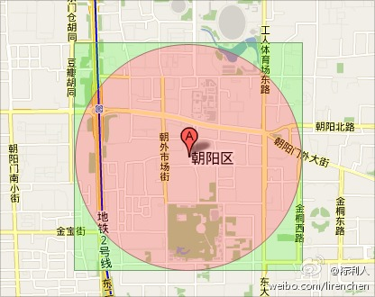

# 本章堆栈树图相关的习题

**1、附近地点搜索**

找一个点集中与给定点距离最近的点，同时，给定的二维点集都是固定的，查询可能有很多次，例如，坐标(39.91, 116.37)附近500米内有什么餐馆，那么让你来设计，该怎么做？



提示：可以建立R树进行二维搜索，或使用GeoHash算法解决。

**2、最小操作数**

给定一个单词集合Dict，其中每个单词的长度都相同。现从此单词集合Dict中抽取两个单词A、B，我们希望通过若干次操作把单词A变成单词B，每次操作可以改变单词的一个字母，同时，新产生的单词必须是在给定的单词集合Dict中。求所有行得通步数最少的修改方法。

举个例子如下：

  Given:
     A = "hit"
     B = "cog"
     Dict = ["hot","dot","dog","lot","log"]
  Return
   [
     ["hit","hot","dot","dog","cog"],
     ["hit","hot","lot","log","cog"]
   ]

即把字符串A = "hit"转变成字符串B = "cog"，有以下两种可能：

"hit" -> "hot" ->  "dot" ->  "dog" -> "cog"；

"hit" ->  "hot" ->  "lot" ->  "log"  ->"cog"。

提示：建图然后搜索。

**3、最少操作次数的简易版**

给定两个字符串，仅由小写字母组成，它们包含了相同字符。
求把第一个字符串变成第二个字符串的最小操作次数，且每次操作只能对第一个字符串中的某个字符移动到此字符串中的开头。
例如给定两个字符串“abcd" "bcad" ，输出：2，因为需要操作2次才能把"abcd"变成“bcad" ，方法是：abcd->cabd->bcad。

**3、把二元查找树转变成排序的双向链表**

输入一棵二元查找树，将该二元查找树转换成一个排序的双向链表。
要求不能创建任何新的结点，只调整指针的指向。

   10
   
  / /
  
  6  14
  
 / / / /
 
4  8 12 

 转换成双向链表
 
4=6=8=10=12=14=16。

**4、在二元树中找出和为某一值的所有路径**

输入一个整数和一棵二元树。
从树的根结点开始往下访问一直到叶结点所经过的所有结点形成一条路径。
打印出和与输入整数相等的所有路径。
例如 输入整数22和如下二元树

    10  
  /   /   
 5    12   
/ \   
4  7

**5、判断整数序列是不是二元查找树的后序遍历结果**

题目：输入一个整数数组，判断该数组是不是某二元查找树的后序遍历的结果，如果是返回true，否则返回false。

例如输入5、7、6、9、11、10、8，由于这一整数序列是如下树的后序遍历结果：

         8
      /  /
     6    10
    / /  / /
    
   5  7 9  11
因此返回true。

如果输入7、4、6、5，没有哪棵树的后序遍历的结果是这个序列，因此返回false。

**6、设计包含min函数的栈**

定义栈的数据结构，要求添加一个min函数，能够得到栈的最小元素。要求函数min、push以及pop的时间复杂度都是O(1)。

**7、求二叉树中节点的最大距离**

如果我们把二叉树看成一个图，父子节点之间的连线看成是双向的，我们姑且定义"距离"为两节点之间边的个数。

请写一个程序，求一棵二叉树中相距最远的两个节点之间的距离。

**8**

输入一颗二元树，从上往下按层打印树的每个结点，同一层中按照从左往右的顺序打印。 

例如输入

   8
   
  / /
  
 6 10
 
/ / / /

5 7 9 11

输出8 6 10 5 7 9 11。

**9**

请用递归和非递归俩种方法实现二叉树的前序遍历。


**10、求树的深度**

输入一棵二元树的根结点，求该树的深度。

从根结点到叶结点依次经过的结点（含根、叶结点）形成树的一条路径，最长路径的长度为树的深度。

例如：输入二元树：
                                            10
                                            
                                          /     /
                                          
                                        6        14
                                        
                                      /         /   /
                                      
                                    4         12     16
                                    
输出该树的深度3。

实现简单的一个查找二叉树的深度的函数。

**11、用俩个栈实现队列**

某队列的声明如下：
```cpp
template<typename T> class CQueue
{
public:
      CQueue() {}
      ~CQueue() {}
      void appendTail(const T& node);  // append a element to tail
      void deleteHead();               // remove a element from head
private:
     T> m_stack1;
     T> m_stack2;
};
```
提示：这道题实质上是要求我们用两个栈来实现一个队列。栈是一种后入先出的数据容器，因此对队列进行的插入和删除操作都是在栈顶上进行；队列是一种先入先出的数据容器，我们总是把新元素插入到队列的尾部，而从队列的头部删除元素。


**12**

假设有一颗二叉树，已知这棵树的节点上不均匀的分布了若干石头，石头数跟这棵二叉树的节点数相同，石头只可以在子节点和父节点之间进行搬运，每次只能搬运一颗石头。请问如何以最少的步骤将石头搬运均匀，使得每个节点上的石头上刚好为1。


**13**

对于一颗完全二叉树，要求给所有节点加上一个pNext指针，指向同一层的相邻节点；如果当前节点已经是该层的最后一个节点，则将pNext指针指向NULL；给出程序实现，并分析时间复杂度和空间复杂度。


**14**

两个用户之间可能互相认识，也可能是单向的认识，用什么数据结构来表示？如果一个用户不认识别人，而且别人也不认识他，那么他就是无效节点，如何找出这些无效节点？自定义数据接口并实现之，要求尽可能节约内存和空间复杂度。

**15**

有一个一亿节点的树，现在已知两个点，找这两个点的共同的祖先。


**16**

给一个二叉树，每个节点都是正或负整数，如何找到一个子树，它所有节点的和最大？ 

提示：后序遍历，每一个节点保存左右子树的和加上自己的值。额外一个空间存放最大值。

写完后序遍历，面试官可能接着与你讨论，
- a). 如果要求找出只含正数的最大子树，程序该如何修改来实现？
- b). 假设我们将子树定义为它和它的部分后代，那该如何解决？
- c). 对于b，加上正数的限制，方案又该如何？

总之，一道看似简单的面试题，可能能变换成各种花样。

比如，面试管可能还会再提两个要求：第一，不能用全局变量；第二，有个参数控制是否要只含正数的子树。


**17**

有一个排序二叉树，数据类型是int型，如何找出中间大的元素。


**18**

中序遍历二叉树，结果为ABCDEFGH，后序遍历结果为ABEDCHGF，那么前序遍历结果为?


**19**

写程序输出8皇后问题的所有排列，要求使用非递归的深度优先遍历。


**20**

在8X8的棋盘上分布着n个骑士，他们想约在某一个格中聚会。骑士每天可以像国际象棋中的马那样移动一次，可以从中间像8个方向移动（当然不能走出棋盘），请计算n个骑士的最早聚会地点和要走多少天。要求尽早聚会，且n个人走的总步数最少，先到聚会地点的骑士可以不再移动等待其他的骑士。

从键盘输入n（0<n<=64），然后一次输入n个骑士的初始位置xi,yi（0<=xi,yi<=7）。屏幕输出以空格分隔的三个数，分别为聚会点（x，y）以及走的天数。

提示：BFS。


**21、城市遍历**

某人家住北京，想去青海玩，可能会经过许多城市，现已知地图上的城市连接，求经过M个城市到达青海的路线种类。城市可以多次到达的，比如去了天津又回到北京，再去天津，即为3次。北京出发不算1次。

输入：

N  M  S
    N为城市总数，北京为0，青海为N-1；
    M为经过的城市数目；
    S为之后有S行
i  j
    表示第i个城市可以去第j个城市，是有方向的。

输出：
N
    表示路径种类。


**22**

给定两个站点，如果没有直达的路线，如何找到换乘次数最少的路线？


**23**

有两座桥，其中一座可能是坏的，两个守桥人分别守在这两座桥的入口。他们一个总是会说实话，一个总是说谎话。
你现在需要找出哪一座桥可以通过。

请问最少需要问守桥人几个问题，可以找出可以通过的桥？如何问？


**24**

一类似于蜂窝的结构的图，进行搜索最短路径（要求5分钟）。


**25**

对于一颗完全二叉树，要求给所有节点加上一个pNext指针，指向同一层的相邻节点；如果当前节点已经是该层的最后一个节点，则将pNext指针指向NULL；给出程序实现，并分析时间复杂度和空间复杂度。


