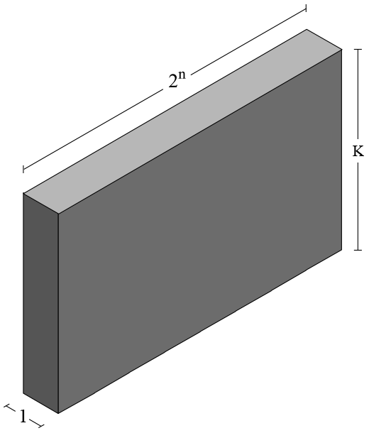

# 本章动态规划的习题

**1、子序列个数**

子序列的定义：对于一个序列a=a[1],a[2],......a[n]，则非空序列a'=a[p1],a[p2]......a[pm]为a的一个子序列
其中1<=p1<p2<.....<pm<=n。 例如：4,14,2,3和14,1,2,3都为4,13,14,1,2,3的子序列。
 - 对于给出序列a，有些子序列可能是相同的，这里只算做1个
 - 要求输出a的不同子序列的数量。

**2、数塔取数问题**

一个高度为N的由正整数组成的三角形，从上走到下，求经过的数字和的最大值。
每次只能走到下一层相邻的数上，例如从第3层的6向下走，只能走到第4层的2或9上。

   5
   
  8 4
  
 3 6 9
 
7 2 9 5

例子中的最优方案是：5 + 8 + 6 + 9 = 28。


**3、木块砌墙**

用 1×1×1, 1×2×1以及2×1×1的三种木块（横绿竖蓝，且绿蓝长度均为2），


搭建高长宽分别为K × 2^N × 1的墙，不能翻转、旋转（其中，0<=N<=1024，1<=K<=4）



有多少种方案，输出结果

对1000000007取模。

举个例子如给定高度和长度：N=1 K=2，则答案是7，即有7种搭法，如下图所示：


分析：此题很有意思，涉及的知识点也比较多，包括动态规划，快速矩阵幂，状态压缩，排列组合等等都一一考察了个遍。而且跟一个比较经典的矩阵乘法问题类似：即用1 x 2的多米诺骨牌填满M x N的矩形有多少种方案，M<=5，N<2^31，输出答案mod p的结果


**4、最长公共子序列**

什么是最长公共子序列呢?好比一个数列 S，如果分别是两个或多个已知数列的子序列，且是所有符合此条件序列中最长的，则S 称为已知序列的最长公共子序列。  

举个例子，如：有两条随机序列，如 1 3 4 5 5 ，and 2 4 5 5 7 6，则它们的最长公共子序列便是：4 5 5。  

分析：最容易想到的算法是穷举搜索法，即对X的每一个子序列，检查它是否也是Y的子序列，从而确定它是否为X和Y的公共子序列，并且在检查过程中选出最长的公共子序列。X和Y的所有子序列都检查过后即可求出X和Y的最长公共子序列。X的一个子序列相应于下标序列{1, 2, …, m}的一个子序列，因此，X共有2m个不同子序列（Y亦如此，如为2^n），从而穷举搜索法需要指数时间（2^m * 2^n）。  

事实上，最长公共子序列问题也有最优子结构性质。  

记：  
  Xi=﹤x1，⋯，xi﹥即X序列的前i个字符 (1≤i≤m)（前缀）  
 
  Yj=﹤y1，⋯，yj﹥即Y序列的前j个字符 (1≤j≤n)（前缀）  

假定Z=﹤z1，⋯，zk﹥∈LCS(X , Y) 。 

* 若**xm=yn**（最后一个字符相同），则不难用反证法证明：该字符必是X与Y的任一最长公共子序列Z（设长度为k）的最后一个字符，即有zk = xm = yn 且显然有Zk-1∈LCS(Xm-1 , Yn-1)即Z的前缀**Zk-1是Xm-1与Yn-1的最长公共子序列。**此时，问题化归成求Xm-1与Yn-1的LCS（LCS(X , Y)的长度等于LCS(Xm-1 , Yn-1)的长度加1）。  

* 若**xm≠yn**，则亦不难用反证法证明：要么Z∈LCS(Xm-1, Y)，要么Z∈LCS(X , Yn-1)。由于zk≠xm与zk≠yn其中至少有一个必成立，若zk≠xm则有Z∈LCS(Xm-1 , Y)，类似的，若zk≠yn 则有Z∈LCS(X , Yn-1)。此时，问题化归成求Xm-1与Y的LCS及X与Yn-1的LCS。LCS(X , Y)的长度为：max{LCS(Xm-1 , Y)的长度, LCS(X , Yn-1)的长度}。  
由于上述当**xm≠yn**的情况中，求LCS(Xm-1 , Y)的长度与LCS(X , Yn-1)的长度，这两个问题不是相互独立的：两者都需要求LCS(Xm-1，Yn-1)的长度。另外两个序列的LCS中包含了两个序列的前缀的LCS，故问题具有最优子结构性质考虑用动态规划法。  

也就是说，解决这个LCS问题，你要求三个方面的东西：1、LCS(Xm-1，Yn-1)+1；2、LCS(Xm-1，Y)，LCS(X，Yn-1)；3、max{LCS(Xm-1, Y)，LCS(X, Yn-1)}。  

**5、最长递增子序列**

给定一个长度为N的数组a0,a1,a2...,an-1，找出一个最长的单调递增子序列（注：递增的意思是对于任意的i<j，都满足ai<aj，此外子序列的意思是不要求连续，顺序不乱即可）。例如：给定一个长度为6的数组A{5， 6， 7， 1， 2， 8}，则其最长的单调递增子序列为{5，6，7，8}，长度为4。

分析：一种解法是转换为最长公共子序列问题

比如原数组为
 - A{5， 6， 7， 1， 2， 8}，
 
当我们对这个数组进行排序后，排序后的数组为：
 - A‘{1， 2， 5， 6， 7， 8}。
 
然后想求数组A的最长递增子序列，其实就是求数组A与它的排序数组A‘的最长公共子序列，原因是原数组A的子序列顺序保持不变，而且排序后A‘本身就是递增的，这样，就保证了两序列的最长公共子序列的递增特性。

如此，若想求数组A的最长递增子序列，其实就是求数组A与它的排序数组A‘的最长公共子序列。

另外一种解法则是动态规划。想到这个问题不能改变元素各自的相对顺序，所以我们不能排序，在不能排序的情况下，我们考虑下是否能用动态规划解决。

定义dp[i]为以ai为末尾的最长递增子序列的长度，故以ai结尾的递增子序列
 - 要么是只包含ai的子序列
 - 要么是在满足j<i并且aj<ai的以ai为结尾的递增子序列末尾，追加上ai后得到的子序列
 
如此，便可建立递推关系，在O(N^2)时间内解决这个问题。参考代码如下：
```c
int n;
int a[n];

int dp[n];

void lis()
{
	int res = 0;
	int i;
	for (i = 0; i < n; i++)
	{
		dp[i] = (dp[i] > dp[i + 1] )? dp[i]:dp[i + 1];
	}
	res = (res > dp[i])?res:dp[i];
	printf("%d\n,res");
}
```
