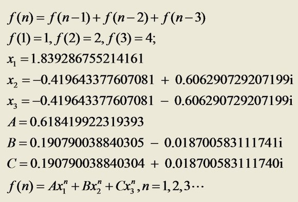

## 跳台阶问题


### 题目描述
一个台阶总共有n 级，如果一次可以跳1 级，也可以跳2 级。

求总共有多少总跳法，并分析算法的时间复杂度。


### 分析与解法

#### 解法一
首先考虑最简单的情况。如果只有1级台阶，那显然只有一种跳法。如果有2级台阶，那就有两种跳的方法了：一种是分两次跳，每次跳1级；另外一种就是一次跳2级。

现在我们再来讨论一般情况。我们把n级台阶时的跳法看成是n的函数，记为f(n)。当n>2时，第一次跳的时候就有两种不同的选择：一是第一次只跳1级，此时跳法数目等于后面剩下的n-1级台阶的跳法数目，即为f(n-1)；另外一种选择是第一次跳2级，此时跳法数目等于后面剩下的n-2级台阶的跳法数目，即为f(n-2)。因此n级台阶时的不同跳法的总数f(n)=f(n-1)+f(n-2)。


我们把上面的分析用一个公式总结如下：
```
        /  1                             n = 1
f(n)=      2                             n = 2
        \  f(n-1) + f(n-2)               n > 2
```

原来上述问题就是我们平常所熟知的Fibonacci数列问题。可编写代码，如下：

```cpp
long long Fibonacci_Solution1(unsigned int n)
{
    int result[3] = {0, 1, 2};
    if (n <= 2)
        return result[n];

    return Fibonacci_Solution1(n - 1) + Fibonacci_Solution1(n - 2);
}
```

那么，如果是人人笔试那道题呢?一个人上台阶可以一次上1个，2个，或者3个，岂不是可以轻而易举的写下如下公式：
```
        / 1                                      n = 1
f(n)=     2                                      n = 2
          4                                      n = 3       //111, 12, 21, 3
        \ f(n-1)+f(n-2)+f(n-3)                   n > 3
```

#### 解法三
一维数组dp记录每个台阶的方法数，且令dp[i] = dp[i-1] + dp[i-2]，初始化时，dp[0]=dp[1]=1，然后递推计算即可dp[n] = dp[n-1] + dp[n-2]; 

参考代码如下：
```java
int ClimbStairs(int n)
{
	if (n == 0 || n == 1)
		return 1;
	int[] dp = new int[n + 1];
	dp[0] = 1;
	dp[1] = 1;
	for (int i = 2; i < n + 1; i++){
		dp[i] = dp[i - 1] + dp[i - 2]; /* 从其他地方可达路径*/
	}
	return dp[n];
}
```

#### 解法二

其实这个台阶问题只需求幂就可以了（求复数幂C++库里有），不用任何循环且复杂度为O（1），如下图所示，是否真如此?:




### 举一反三

1、兔子繁殖问题

13世纪意大利数学家斐波那契在他的《算盘书》中提出这样一个问题：有人想知道一年内一对兔子可繁殖成多少对，便筑了一道围墙把一对兔子关在里面。已知一对兔子每一个月可以生一对小兔子，而一对兔子出生后.第三个月开始生小兔子假如一年内没有发生死亡，则一对兔子一年内能繁殖成多少对？

分析：这就是斐波那契数列的由来，本节的跳台阶问题便是此问题的变形，只是换了种表述形式。

2、换硬币问题。

想兑换100元钱，有1,2,5,10四种钱，问总共有多少兑换方法。
```
const int N = 100;
int dimes[] = {1,2,5,10};
int arr[N+1]  = {1};
for (int i = 0; i < 101; ++i)
{
    for(int j = 0; j < sizeof(dimes)/sizeof(int); ++j)
    {
        if (i + dimes[j] < 101)
            arr[i + dimes[j]] += arr[i];
    }
}
/* arr[100]  即为可以兑换的种类。*/
```

此问题还有一个变形，就是打印出路径目前只想到要使用递归来解决这个问题。对此，利用一个vector来保存路径，每进入一层，push_back一个路径，每退出一层，pop_back一个路径。
