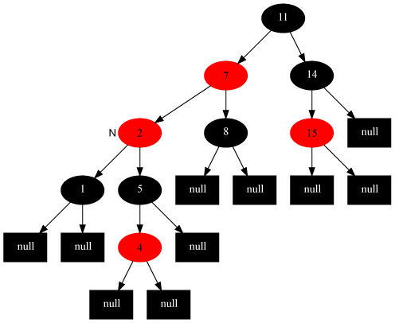
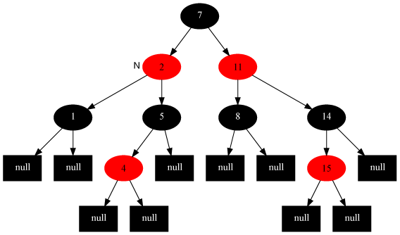
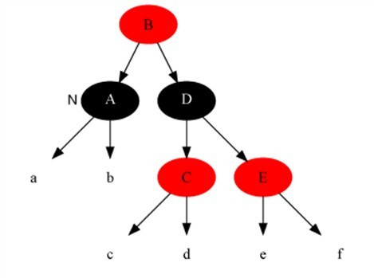
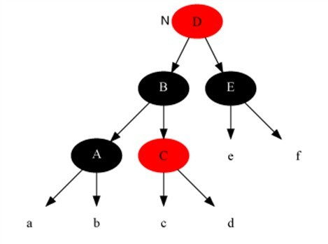
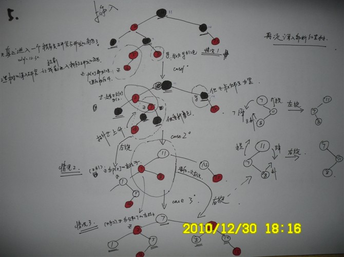
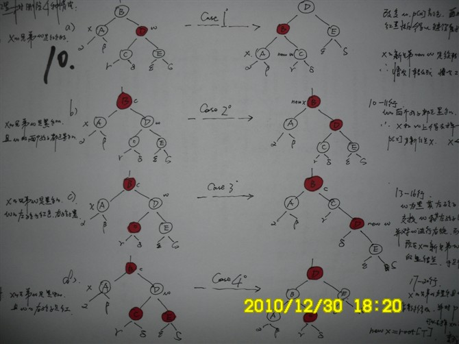

# 教你透彻了解红黑树

作者：July、saturnman   2010年12月29日  

本文参考：Google、算法导论、STL源码剖析、计算机程序设计艺术  

推荐阅读：Left-Leaning Red-Black Trees, Dagstuhl Workshop on Data Structures, Wadern, Germany, February, 2008.   
直接下载：<http://www.cs.princeton.edu/~rs/talks/LLRB/RedBlack.pdf>。  


## 二叉查找树

由于红黑树本质上就是一棵二叉查找树，所以在了解红黑树之前，咱们先来看下二叉查找树。

二叉查找树（Binary Search Tree），也称有序二叉树（ordered binary tree）,排序二叉树（sorted binary tree），是指一棵空树或者具有下列性质的二叉树：

 ·若任意节点的左子树不空，则左子树上所有结点的值均小于它的根结点的值；
 ·任意节点的右子树不空，则右子树上所有结点的值均大于它的根结点的值；
 ·任意节点的左、右子树也分别为二叉查找树。
 ·没有键值相等的节点（no duplicate nodes）。

因为，一棵由n个结点，随机构造的二叉查找树的高度为lgn，所以顺理成章，一般操作的执行时间为O（lgn）。
//至于n个结点的二叉树高度为lgn的证明，可参考算法导论 第12章 二叉查找树 第12.4节。
但二叉树若退化成了一棵具有n个结点的线性链后，则此些操作最坏情况运行时间为O（n）。后面我们会看到一种基于二叉查找树-红黑树，它通过一些性质使得树相对平衡，最终查找、插入、删除的时间复杂度最坏情况下依然为O（lgn）。

了解了二叉查找树的基本性质还不够，因为若要理解红黑树的插入和删除，得先理解二叉查找树的插入和删除。磨刀不误砍柴工，咱们再来分别了解下二叉查找树的插入和删除。

### 二叉查找树的插入

如果要在二叉查找树中插入一个结点，首先要查找到结点插入的位置，然后进行插入，假设插入的结点为z的话，插入的伪代码如下：

```
TREE-INSERT(T, z)
 1  y ← NIL
 2  x ← root[T]
 3  while x ≠ NIL
 4      do y ←  x
 5         if key[z] < key[x]
 6            then x ← left[x]
 7            else x ← right[x]
 8  p[z] ← y
 9  if y = NIL
10     then root[T] ← z              ⊹ Tree T was empty
11     else if key[z] < key[y]
12             then left[y] ← z
13             else right[y] ← z
```

我们可以看到，上述第3-7行代码即是在二叉查找树中查找z待插入的位置，如果插入结点z小于当前遍历到的结点，则到当前结点的左子树中继续查找，如果z大于当前结点，则到当前结点的右子树中继续查找，第9-13行代码找到待插入的位置，如果z依然比此刻遍历到的新的当前结点小，则z作为当前结点的左孩子，否则作为当前结点的右孩子。

### 二叉查找树的删除

```
TREE-DELETE(T, z)
 1  if left[z] = NIL or right[z] = NIL
 2      then y ← z
 3      else y ← TREE-SUCCESSOR(z)
 4  if left[y] ≠ NIL
 5      then x ← left[y]
 6      else x ← right[y]
 7  if x ≠ NIL
 8      then p[x] ← p[y]
 9  if p[y] = NIL
10      then root[T] ← x
11      else if y = left[p[y]]
12              then left[p[y]] ← x
13              else right[p[y]] ← x
14  if y ≠ z
15      then key[z] ← key[y]
16           copy y's satellite data into z
17  return y
```

## 红黑树的介绍

前面我们已经说过，红黑树，本质上来说就是一棵二叉查找树，但它在二叉查找树的基础上增加了着色和相关的性质使得红黑树相对平衡，从而保证了红黑树的查找、插入、删除的时间复杂度最坏为O(log n)。

下面，咱们便来具体看看红黑树的5条性质：

	1）每个结点要么是红的，要么是黑的。  
	2）根结点是黑的。  
	3）每个叶结点（叶结点即指树尾端NIL指针或NULL结点）是黑的。  
	4）如果一个结点是红的，那么它的俩个儿子都是黑的。  
	5）对于任一结点而言，其到叶结点树尾端NIL指针的每一条路径都包含相同数目的黑结点。  

（注：上述第3、5点性质中所说的NULL结点，包括wikipedia.算法导论上所认为的叶子结点即为树尾端的NIL指针，或者说NULL结点。然百度百科以及网上一些其它博文直接说的叶结点，则易引起误会，因，此叶结点非子结点）  

如下图所示，即是一颗红黑树(下图引自wikipedia：<http://t.cn/hgvH1l>)：


此图忽略了叶子和根部的父结点。同时，上文中我们所说的 "叶结点" 或"NULL结点"，如上图所示，它不包含数据而只充当树在此结束的指示，这些节点在绘图中经常被省略，望看到此文后的读者朋友注意。 

## 树的旋转知识

当我们在对红黑树进行插入和删除等操作时，对树做了修改，那么可能会违背红黑树的性质。  

为了继续保持红黑树的性质，我们可以通过对结点进行重新着色，以及树进行相关的旋转操作，即修改树种某些结点的颜色及指针结构，来达到对红黑树进行插入、删除结点等操作时，继续保持它的性质或平衡。  

树的旋转，分为左旋和右旋，以下借助图来做形象的解释和介绍：  

1.左旋  


如上图所示：  

当在某个结点pivot上，做左旋操作时，我们假设它的右孩子y不是NIL[T]，pivot可以为树内任意左孩子而不是NIL[T]的结点。  

左旋以pivot到y之间的链为“支轴”进行，它使y成为该孩子树新的根，而y的左孩子b则成为pivot的右孩子。  

左旋操作的参考代码如下所示（以x代替上述的pivot）：  

```
 LEFT-ROTATE(T, x)  
1  y ← right[x] ▹ Set y.  
2  right[x] ← left[y]      ▹ Turn y's left subtree into x's right subtree.  
3  p[left[y]] ← x  
4  p[y] ← p[x]             ▹ Link x's parent to y.  
5  if p[x] = nil[T]  
6     then root[T] ← y  
7     else if x = left[p[x]]  
8             then left[p[x]] ← y  
9             else right[p[x]] ← y  
10  left[y] ← x             ▹ Put x on y's left.  
11  p[x] ← y  
```

2.右旋  

右旋与左旋差不多，再此不做详细介绍。  


对于树的旋转，能保持不变的只有原树的搜索性质，而原树的红黑性质则不能保持，在红黑树的数据插入和删除后可利用旋转和颜色重涂来恢复树的红黑性质。  

## 红黑树的插入

上文，我们了解了二叉查找树的删除，咱们便来具体了解红黑树的插入操作。红黑树的插入相当于在二叉查找树插入的基础上，为了重新恢复平衡，继续做了插入修复操作。

假设插入的结点为z，红黑树的插入伪代码具体如下所示：  

```
RB-INSERT(T, z)  
 1  y ← nil[T]  
 2  x ← root[T]  
 3  while x ≠ nil[T]  
 4      do y ← x  
 5         if key[z] < key[x]  
 6            then x ← left[x]  
 7            else x ← right[x]  
 8  p[z] ← y  
 9  if y = nil[T]  
10     then root[T] ← z  
11     else if key[z] < key[y]  
12             then left[y] ← z  
13             else right[y] ← z  
14  left[z] ← nil[T]  
15  right[z] ← nil[T]  
16  color[z] ← RED  
17  RB-INSERT-FIXUP(T, z)  
```

我们把上面这段红黑树的插入代码，跟我们之前看到的二叉查找树的插入代码，可以看出，RB-INSERT(T, z)前面的第1-13行代码基本就是二叉查找树的插入代码，然后第14-16行代码把z的左孩子、右孩子都赋为叶结点nil，再把z结点着为红色，最后为保证红黑性质在插入操作后依然保持，调用一个辅助程序RB-INSERT-FIXUP来对结点进行重新着色，并旋转。  

如果插入的是根结点，因为原树是空树，此情况只会违反性质2，所以直接把此结点涂为黑色。  
如果插入的结点的父结点是黑色，由于此不会违反性质2和性质4，红黑树没有被破坏，所以此时也是什么也不做。  
  
但
 - 插入情况1：:如果当前结点的父结点是红色且祖父结点的另一个子结点（叔叔结点）是红色:，
 - 插入情况2：当前节点的父节点是红色,叔叔节点是黑色，当前节点是其父节点的右子
 - 插入情况3：当前节点的父节点是红色,叔叔节点是黑色，当前节点是其父节点的左子:

又该如何调整呢？答案就是根据红黑树插入代码RB-INSERT(T, z)最后一行调用的RB-INSERT-FIXUP（T,z）所示操作进行，具体如下所示：  
```
RB-INSERT-FIXUP（T,z）
 1 while color[p[z]] = RED  
 2     do if p[z] = left[p[p[z]]]  
 3           then y ← right[p[p[z]]]  
 4                if color[y] = RED  
 5                   then color[p[z]] ← BLACK                    ▹ Case 1  
 6                        color[y] ← BLACK                       ▹ Case 1  
 7                        color[p[p[z]]] ← RED                   ▹ Case 1  
 8                        z ← p[p[z]]                            ▹ Case 1  
 9                   else if z = right[p[z]]  
10                           then z ← p[z]                       ▹ Case 2  
11                                LEFT-ROTATE(T, z)              ▹ Case 2  
12                           color[p[z]] ← BLACK                 ▹ Case 3  
13                           color[p[p[z]]] ← RED                ▹ Case 3  
14                           RIGHT-ROTATE(T, p[p[z]])            ▹ Case 3  
15           else (same as then clause  
                         with "right" and "left" exchanged)  
16 color[root[T]] ← BLACK  
```

**插入修复情况1：当前结点的父结点是红色且祖父结点的另一个子结点（叔叔结点）是红色。**  

即如下代码所示：
```
 1 while color[p[z]] = RED  
 2     do if p[z] = left[p[p[z]]]  
 3           then y ← right[p[p[z]]]  
 4                if color[y] = RED  
```

此时父结点的父结点一定存在，否则插入前就已不是红黑树。  
与此同时，又分为父结点是祖父结点的左子还是右子，对于对称性，我们只要解开一个方向就可以了。  

在此，我们只考虑父结点为祖父左子的情况。  
同时，还可以分为当前结点是其父结点的左子还是右子，但是处理方式是一样的。我们将此归为同一类。  

  对策：将当前节点的父节点和叔叔节点涂黑，祖父结点涂红，把当前结点指向祖父节点，从新的当前节点重新开始算法。即如下代码所示：

```
 5                   then color[p[z]] ← BLACK                    ▹ Case 1  
 6                        color[y] ← BLACK                       ▹ Case 1  
 7                        color[p[p[z]]] ← RED                   ▹ Case 1  
 8                        z ← p[p[z]]                            ▹ Case 1  
```

针对情况1，变化前（图片来源：saturnman）[当前节点为4节点]：  


变化后：  


**插入修复情况2：当前节点的父节点是红色,叔叔节点是黑色，当前节点是其父节点的右子**  
  对策：当前节点的父节点做为新的当前节点，以新当前节点为支点左旋。即如下代码所示：
```
 9                   else if z = right[p[z]]
10                           then z ← p[z]                       ▹ Case 2
11                                LEFT-ROTATE(T, z)              ▹ Case 2
```
如下图所示，变化前[当前节点为7节点]：  


变化后：


**插入修复情况3：当前节点的父节点是红色,叔叔节点是黑色，当前节点是其父节点的左子**  
解法：父节点变为黑色，祖父节点变为红色，在祖父节点为支点右旋，操作代码为：
```
12                           color[p[z]] ← BLACK                 ▹ Case 3
13                           color[p[p[z]]] ← RED                ▹ Case 3
14                           RIGHT-ROTATE(T, p[p[z]])            ▹ Case 3
```

如下图所示[当前节点为2节点]  



变化后：  




## 红黑树的删除

ok，接下来，咱们最后来了解，红黑树的删除操作。
为了保证以下的介绍与阐述清晰，我第三次重写下红黑树的5个性质  

"我们删除的节点的方法与常规二叉搜索树中删除节点的方法是一样的，如果被删除的节点不是有双非空子女，则直接删除这个节点，用它的唯一子节点顶替它的位置，如果它的子节点分是空节点，那就用空节点顶替它的位置，如果它的双子全为非空，我们就把它的直接后继节点内容复制到它的位置，之后以同样的方式删除它的后继节点，它的后继节点不可能是双子非空，因此此传递过程最多只进行一次。”  

继续讲解之前，补充说明下二叉树结点删除的几种情况，待删除的节点按照儿子的个数可以分为三种：  

1. 没有儿子，即为叶结点。直接把父结点的对应儿子指针设为NULL，删除儿子结点就OK了。
2. 只有一个儿子。那么把父结点的相应儿子指针指向儿子的独生子，删除儿子结点也OK了。
3. 有两个儿子。这是最麻烦的情况，因为你删除节点之后，还要保证满足搜索二叉树的结构。其实也比较容易，我们可以选择左儿子中的最大元素或者右儿子中的最小元素放到待删除节点的位置，就可以保证结构的不变。当然，你要记得调整子树，毕竟又出现了节点删除。习惯上大家选择左儿子中的最大元素，其实选择右儿子的最小元素也一样，没有任何差别，只是人们习惯从左向右。这里咱们也选择左儿子的最大元素，将它放到待删结点的位置。左儿子的最大元素其实很好找，只要顺着左儿子不断的去搜索右子树就可以了，直到找到一个没有右子树的结点。那就是最大的了。

OK，回到红黑树上来。红黑树结点删除的算法实现是：   
RB-DELETE(T, z)   单纯删除结点的总操作  
```
 1 if left[z] = nil[T] or right[z] = nil[T]  
 2    then y ← z  
 3    else y ← TREE-SUCCESSOR(z)  
 4 if left[y] ≠ nil[T]  
 5    then x ← left[y]  
 6    else x ← right[y]  
 7 p[x] ← p[y]  
 8 if p[y] = nil[T]  
 9    then root[T] ← x  
10    else if y = left[p[y]]  
11            then left[p[y]] ← x  
12            else right[p[y]] ← x  
13 if y ≠ z  
14    then key[z] ← key[y]  
15         copy y's satellite data into z  
16 if color[y] = BLACK  
17    then RB-DELETE-FIXUP(T, x)  
18 return y  
```

“在删除节点后，原红黑树的性质可能被改变，如果删除的是红色节点，那么原红黑树的性质依旧保持，此时不用做修正操作，如果删除的节点是黑色节点，原红黑树的性质可能会被改变，我们要对其做修正操作。那么哪些树的性质会发生变化呢，如果删除节点不是树唯一节点，那么删除节点的那一个支的到各叶节点的黑色节点数会发生变化，此时性质5被破坏。如果被删节点的唯一非空子节点是红色，而被删节点的父节点也是红色，那么性质4被破坏。如果被删节点是根节点，而它的唯一非空子节点是红色，则删除后新根节点将变成红色，违背性质2。”  

RB-DELETE-FIXUP(T, x)   恢复与保持红黑性质的工作  

```
 1 while x ≠ root[T] and color[x] = BLACK  
 2     do if x = left[p[x]]  
 3           then w ← right[p[x]]  
 4                if color[w] = RED  
 5                   then color[w] ← BLACK                        ▹  Case 1  
 6                        color[p[x]] ← RED                       ▹  Case 1  
 7                        LEFT-ROTATE(T, p[x])                    ▹  Case 1  
 8                        w ← right[p[x]]                         ▹  Case 1  
 9                if color[left[w]] = BLACK and color[right[w]] = BLACK  
10                   then color[w] ← RED                          ▹  Case 2  
11                        x ← p[x]                                ▹  Case 2  
12                   else if color[right[w]] = BLACK  
13                           then color[left[w]] ← BLACK          ▹  Case 3  
14                                color[w] ← RED                  ▹  Case 3  
15                                RIGHT-ROTATE(T, w)              ▹  Case 3  
16                                w ← right[p[x]]                 ▹  Case 3  
17                         color[w] ← color[p[x]]                 ▹  Case 4  
18                         color[p[x]] ← BLACK                    ▹  Case 4  
19                         color[right[w]] ← BLACK                ▹  Case 4  
20                         LEFT-ROTATE(T, p[x])                   ▹  Case 4  
21                         x ← root[T]                            ▹  Case 4  
22        else (same as then clause with "right" and "left" exchanged)  
23 color[x] ← BLACK  
```

“上面的修复情况看起来有些复杂，下面我们用一个分析技巧：我们从被删节点后来顶替它的那个节点开始调整，并认为它有额外的一重黑色。这里额外一重黑色是什么意思呢，我们不是把红黑树的节点加上除红与黑的另一种颜色，这里只是一种假设，我们认为我们当前指向它，因此空有额外一种黑色，可以认为它的黑色是从它的父节点被删除后继承给它的，它现在可以容纳两种颜色，如果它原来是红色，那么现在是红+黑，如果原来是黑色，那么它现在的颜色是黑+黑。有了这重额外的黑色，原红黑树性质5就能保持不变。现在只要恢复其它性质就可以了，做法还是尽量向根移动和穷举所有可能性。"--saturnman。  

红黑树删除修复操作的几种情况@saturnman：  

(注：以下的情况3、4、5、6，与上述算法导论之代码RB-DELETE-FIXUP(T, x) 恢复与保持
中case1，case2，case3，case4相对应。)  

删除修复情况1：当前节点是红+黑色  
    解法，直接把当前节点染成黑色，结束。  
此时红黑树性质全部恢复。  
删除修复情况2：当前节点是黑+黑且是根节点  
    解法：什么都不做，结束  
删除修复情况3：当前节点是黑+黑且兄弟节点为红色(此时父节点和兄弟节点的子节点分为黑)。  
    解法：把父节点染成红色，把兄弟结点染成黑色，之后重新进入算法（我们只讨论当前节点是其父节点左孩子时的情况）。此变换后原红黑树性质5不变，而把问题转化为兄弟节点为黑色的情况(注：变化前，原本就未违反性质5，只是为了**把问题转化为兄弟节点为黑色的情况**)。  

变化前：  


变化后：  


删除修复情况4：当前节点是黑加黑且兄弟是黑色且兄弟节点的两个子节点全为黑色。  
      解法：把当前节点和兄弟节点中抽取一重黑色追加到父节点上，把父节点当成新的当前节点，重新进入算法。（此变换后性质5不变）  

变化前：  


变化后：  


删除修复情况5：当前节点颜色是黑+黑，兄弟节点是黑色，兄弟的左子是红色，右子是黑色。  
    解法：把兄弟结点染红，兄弟左子节点染黑，之后再在兄弟节点为支点解右旋，之后重新进入算法。此是把当前的情况转化为情况6，而性质5得以保持。  

变化前：  


变化后：  


删除修复情况6：当前节点颜色是黑-黑色，它的兄弟节点是黑色，但是兄弟节点的右子是红色，兄弟节点左子的颜色任意。  
    解法：把兄弟节点染成当前节点父节点的颜色，把当前节点父节点染成黑色，兄弟节点右子染成黑色，之后以当前节点的父节点为支点进行左旋，此时算法结束，红黑树所有性质调整正确。  

变化前：  



变化后：  



限于篇幅，不再过多赘述。更多，可参考算法导论或下文我写的第二篇文章。完。  
July、二零一零年十二月二十九日初稿。三十日凌晨修订。  


今下午画红黑树画了好几个钟头，贴俩张图：  
红黑树插入修复的3种情况：  



红黑树删除修复的4种情况：  



ok，只贴俩张，更多，参考我写的关于红黑树的第二篇文章：  
红黑树算法的层层剖析与逐步实现[推荐]  
<http://blog.csdn.net/v_JULY_v/archive/2010/12/31/6109153.aspx>  
这篇文章针对算法实现源码分十层，层层、逐层剖析，相信，更清晰易懂。  
或者，saturnman的这篇文章： <http://saturnman.blog.163.com/blog/static/5576112010969420383/>。  

July、二零一零年十二月三十一日、最后更新。  
